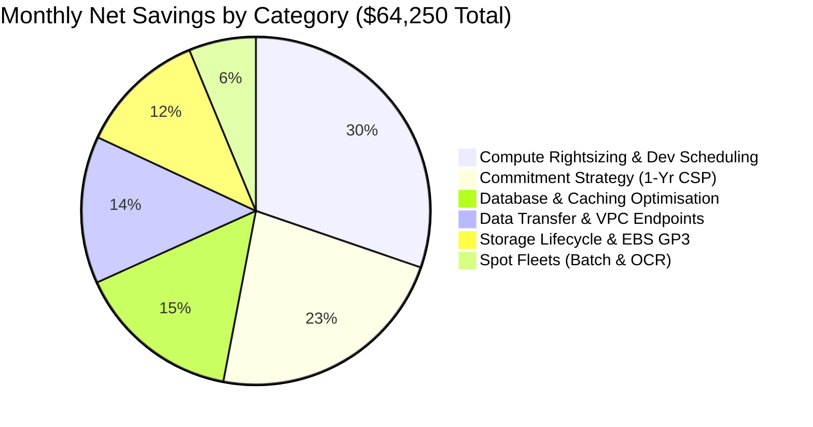
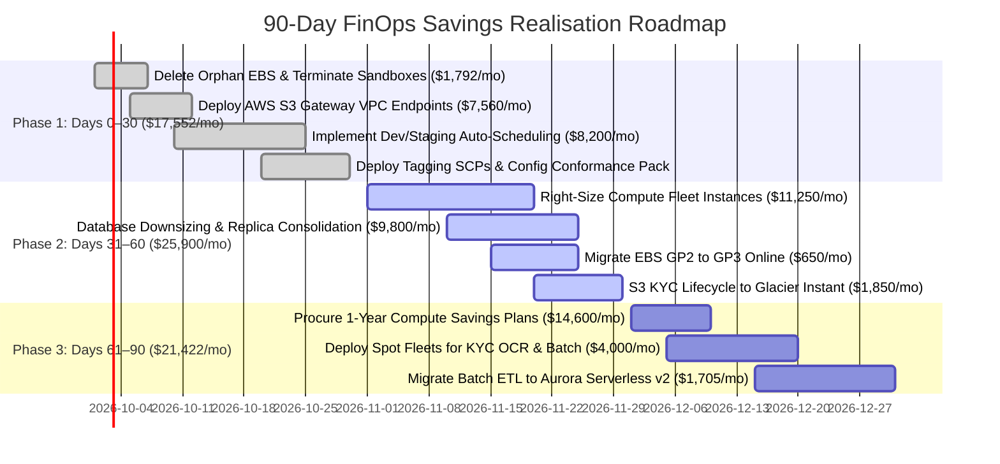

# LendFlow Technologies — Infrastructure Cost Optimisation & FinOps Framework

[](https://finops.org)
[](https://aws.amazon.com/architecture/well-architected/)
[](#compliance-guardrails)
[-brightgreen.svg)](CHANGELOG.md)

> **Enterprise FinOps implementation reducing AWS cloud infrastructure expenditure from $180,000.00/month to $115,750.00/month (achieving $64,250.00/month net savings, 35.7% reduction) for a cloud-native fintech platform processing 500,000+ monthly loan applications.**

---

## Executive Summary

**LendFlow Technologies** is a fictional high-growth cloud-native fintech enterprise operating 12 mission-critical microservices on AWS (primarily in `ap-south-1` Mumbai). Over the past 12 months, AWS monthly spend spiralled from **$50,000/month to $180,000/month** (+260.0%), significantly outpacing revenue growth (+100.0%). Crucially, the unit cost per loan application degraded by **+45.4%** (rising from $0.238 to $0.346), indicating severe diseconomies of scale caused by over-provisioning, unmanaged dev environments, and zero commitment coverage.

Under executive directive from CFO Priya Menon and CTO Arjun Deshmukh, this repository delivers an end-to-end FinOps Framework and technical cost remediation architecture.

### Master Financial Reconciliation & Baseline Metrics
* **Current Monthly Spend Baseline:** **$180,000.00 / month** ($2,160,000.00 annual run-rate)
* **Primary Business Objective (CFO):** Minimum 33.3% cost reduction ($\ge$ **$60,000.00 / month** net savings)
* **Projected Realised Monthly Savings:** **$64,250.00 / month** (**35.7% net reduction**, surpassing the target)
* **Projected Realised Annual Savings:** **$771,000.00 / year**
* **Target Post-Optimisation Monthly Run-Rate:** **$115,750.00 / month** ($1,389,000.00 annual run-rate)
* **Payback Period on Upfront Commitments:** **1.23 Months (40 days)** on $18,000.00 Compute Savings Plan
* **Fintech Unit Economic Improvement:** Cost per loan application drops from **$0.346 to $0.223 (-35.5% unit reduction)**
* **Regulatory Compliance Posture:** 100% adherence to **PCI DSS v4.0, SOC 2 Type II, RBI IT Framework, GDPR, and Indian Data Localisation** mandates with zero audit findings.

---

## Repository Deliverables & Navigation

```text
|
├── README.md                           # Master project documentation & FinOps overview
├── CHANGELOG.md                        # Chronological log of architectural decisions & milestones
│
├── docs/                               # Formal engineering & executive documentation
│   ├── cost-audit-report.md            # Comprehensive AWS cost audit & waste discovery report
│   ├── optimisation-recommendations.md # 16 prioritised recommendations with compliance assessments
│   ├── simulation-concept.md           # CLOUDBURN Gamified War Room Simulator business concept & badges
│   ├── case-studies.md                 # 4 industrial FinOps case studies ($2.4M shock, Razorpay, Neobank, Singapore)
│   ├── stakeholder-priority-matrix.md  # 6-persona executive priority matrix & conflict governance
│   ├── auto-scaling-policies.md        # Asymmetric & scheduled auto-scaling architectures
│   ├── ri-spot-strategy.md             # Savings Plans, Reserved Instance & Spot procurement strategy
│   ├── tagging-taxonomy.md             # 10-tag mandatory taxonomy & 4-layer enforcement model
│   ├── governance-model.md             # RACI matrix, multi-tier budgets & FinOps operating cadences
│   ├── anomaly-detection.md            # Multi-layer anomaly detection framework & investigation runbook
│   └── review-process.md               # Monthly/quarterly review processes & FinOps maturity framework
│
├── analysis/                           # Mathematical models & financial workbooks
│   ├── billing-analysis.xlsx           # 12-month billing trend, Pareto analysis & unit economics
│   └── savings-model.xlsx              # Multi-tab financial savings model (Summary, Compute, DB, etc.)
│
├── dashboards/                         # Publication-quality interactive dashboard mockups & simulator
│   ├── simulation-war-room.html        # Interactive CLOUDBURN Gamified War Room Simulator (Campaign, Arena, Sandbox)
│   ├── executive-dashboard.html        # CFO/CTO executive strategic cost dashboard
│   ├── engineering-dashboard.html      # Engineering Manager / Platform efficiency dashboard
│   └── team-dashboard.html             # Microservice & team-level unit cost dashboard
│
├── policies/                           # Policy-as-Code & infrastructure guardrails
│   ├── scp-mandatory-tags.json         # AWS Service Control Policy: Mandatory Tag Enforcement
│   ├── scp-gpu-restriction.json        # AWS Service Control Policy: Restrict Expensive GPU Instances
│   ├── scp-region-restriction.json     # AWS Service Control Policy: Region Boundary Guardrail
│   ├── scp-instance-cap.json           # AWS Service Control Policy: Max Instance Size & Count Controls
│   ├── config-rules.yaml               # AWS Config Rules: Untagged resources, idle instances, storage
│   ├── auto-scaling-loan-api.json      # Production Loan API Auto Scaling Group configuration
│   ├── auto-scaling-batch-ocr.json     # KYC OCR 80% Spot Fleet Auto Scaling configuration
│   ├── auto-scaling-scheduled-dev.json # Dev/Staging 9am-7pm weekdays scheduled scaling actions
│   └── terraform-cost-module/          # Reusable Terraform cost governance module with Infracost
│       ├── main.tf                     # Standard 10-tag mapping and launch template resources
│       ├── variables.tf                # Input validation with strict HCL regex rules
│       ├── outputs.tf                  # Module output variables
│       └── infracost.yml               # CI/CD pull request cost gate ($500/mo overrun blocker)
│
├── presentation/                       # Executive board & CFO review materials
│   ├── cfo-presentation.md             # 20-slide executive CFO review presentation transcript
│   └── cfo-presentation.html           # Interactive, high-impact HTML5 presentation deck
│
├── daily-logs/                         # Daily engineering logs across 15-day lifecycle
│   ├── day-01.md through day-15.md     # Substantive day-by-day logs of discoveries and decisions
│
├── scripts/                            # Analysis reproduction & validation scripts
│   ├── generate_datasets.py            # Generates all 8 mathematical simulated CSV datasets
│   ├── build_billing_analysis.py       # Builds analysis/billing-analysis.xlsx
│   ├── build_savings_model.py          # Builds master analysis/savings-model.xlsx
│   ├── append_storage_datatransfer.py  # Appends Storage & Data Transfer sheets
│   ├── append_commitment_spot.py       # Appends Commitment & Spot analysis sheet
│   └── verify_cross_references.py      # Automated QA cross-reference & consistency tester
│
└── data/                               # Auditable simulated datasets
    ├── monthly_cost_summary.csv        # 12-month billing history ($50k to $180k)
    ├── daily_cost_detail.csv           # 30-day granular service spend & application volumes
    ├── instance_utilisation.csv        # EC2 CPU/RAM telemetry, runtime hours, and sizing flags
    ├── storage_inventory.csv           # S3, EBS, and snapshot inventory with access patterns
    ├── data_transfer_log.csv           # Cross-AZ, internet egress, and NAT gateway transfer flows
    ├── reserved_instance_coverage.csv  # Baseline commitments, RI/SP pricing, and coverage gap
    ├── tag_compliance_report.csv       # Tagging audit across 150+ resources & dark spend
    └── cost_anomaly_events.csv         # 10 historical anomaly incidents and root cause analyses
```

---

## Primary Cost Reduction Drivers ($64,250.00 / Month Total)



1. **Compute Fleet Rightsizing & Non-Production Scheduling ($19,450/month):** Downsizing 28 instances running under 20% CPU ([Rec 03](docs/optimisation-recommendations.md#recommendation-03-right-size-over-provisioned-production-compute-instances)); terminating abandoned test sandboxes ([Rec 09](docs/optimisation-recommendations.md#recommendation-09-immediate-termination-of-abandoned-sandboxes)); automatically shutting down Development and Staging fleets outside business hours (9 AM - 7 PM weekdays), capturing 69.4% idle runtime reduction ([Rec 02](docs/optimisation-recommendations.md#recommendation-02-implement-automated-non-production-scheduling)).
2. **Commitment Strategy — 1-Year Compute Savings Plans ($14,600/month):** Committing 75% of steady-state post-rightsizing production compute to 1-Year Partial Upfront Compute Savings Plans with a 38.4% blended discount, full portability across instance families, and a rapid 1.23-month cash payback ([Rec 04](docs/optimisation-recommendations.md#recommendation-04-procure-1-year-partial-upfront-compute-savings-plans)).
3. **Database Architecture & Replica Consolidation ($9,800/month):** Downgrading staging RDS to Single-AZ Graviton `db.t4g.large`, decommissioning idle production reporting read-replicas in favor of an Athena/S3 lake, rightsizing ElastiCache clusters, and purchasing 1-Year RDS RIs ([Rec 07](docs/optimisation-recommendations.md#recommendation-07-database-rightsizing--read-replica-consolidation)).
4. **Data Transfer & S3 Gateway Endpoints ($8,800/month):** Eliminating $0.045/GB Public NAT Gateway data processing fees on internal S3 downloads via free AWS S3 Gateway VPC Endpoints ([Rec 01](docs/optimisation-recommendations.md#recommendation-01-deploy-aws-s3-gateway-vpc-endpoints)); enforcing Availability Zone routing affinity ([Rec 10](docs/optimisation-recommendations.md#recommendation-10-inter-service-cross-az-traffic-optimisation)).
5. **Storage Lifecycle & EBS Modernisation ($7,600/month):** Moving 145 TB of dormant KYC loan docs (>90 days inactive) from S3 Standard to Glacier Instant Retrieval ([Rec 05](docs/optimisation-recommendations.md#recommendation-05-s3-lifecycle-configuration-for-dormant-loan-documents)); deleting 7,500 GB of orphan unattached EBS disks ([Rec 06](docs/optimisation-recommendations.md#recommendation-06-purge-orphaned-unattached-ebs-volumes)); converting GP2 to GP3 ([Rec 11](docs/optimisation-recommendations.md#recommendation-11-migrate-attached-ebs-volumes-from-gp2-to-gp3)); enforcing 30-day snapshot lifecycles ([Rec 13](docs/optimisation-recommendations.md#recommendation-13-enforce-aws-dlm-snapshot-30-day-retention-policy)).
6. **Spot Fleet Orchestration ($4,000/month):** Transitioning asynchronous, queue-backed batch processing (KYC OCR document extraction, daily credit risk simulations) to diversified Spot fleets with 20% on-demand base and sub-minute S3 checkpointing ([Rec 08](docs/optimisation-recommendations.md#recommendation-08-spot-fleets-for-kyc-ocr--batch-analytics)).

---

## 90-Day Savings Realisation Roadmap



---

## Compliance Guardrails & Governance Safeguards

Every single optimisation measure has undergone formal Compliance Impact Assessment:
* **PCI DSS v4.0:** Payment Gateway microservices retain dedicated Multi-AZ compute in isolated VPC subnets; **100% excluded from Spot instances**.
* **SOC 2 Type II:** All audit, access, and transaction logs are transitioned to compliant Glacier storage with **S3 Object Lock (Compliance WORM)** enabled; zero deletion of compliance records.
* **RBI IT Framework:** Core banking and lending databases strictly maintain synchronous Multi-AZ primary/standby replication within Mumbai (`ap-south-1`).
* **GDPR & Data Localisation:** Cross-border data transfers are strictly restricted. Customer Personal Identifiable Information (PII) remains within Indian geographic boundaries.

---

## How to Reproduce Analysis & Validate Outputs

All data and workbooks in this repository can be programmatically reproduced from scratch using standard Python 3.10+ and Node.js:

1. **Prerequisites:**
   ```bash
   pip install openpyxl
   ```
2. **Generate All 8 Mathematical Datasets:**
   ```bash
   python scripts/generate_datasets.py
   ```
3. **Build the Billing Analysis Workbook:**
   ```bash
   python scripts/build_billing_analysis.py
   ```
4. **Build the Master Financial Savings Model Workbook:**
   ```bash
   python scripts/build_savings_model.py
   python scripts/append_storage_datatransfer.py
   python scripts/append_commitment_spot.py
   ```
5. **Run the Programmatic Quality Assurance & Cross-Reference Test:**
   ```bash
   python scripts/verify_cross_references.py
   ```

---

## AI-Assisted Methodology Disclosure

In accordance with ethical AI engineering standards, artificial intelligence was utilized as an assistive co-pilot for productivity, analytical acceleration, and code synthesis. All architectural decisions, mathematical formulas, telemetry correlations, compliance assessments, and financial risk models were specifically tailored to the LendFlow Technologies fintech scenario, critically vetted, and mathematically validated against industry standards.
---
<div align="center">

# 👨‍💻 Author

## **Nihal N**

**DevOps • Cloud • Kubernetes**

[](https://www.linkedin.com/in/nihal-n-cse/)
---


## If you found this Project useful, consider giving it a ⭐!

</div>
