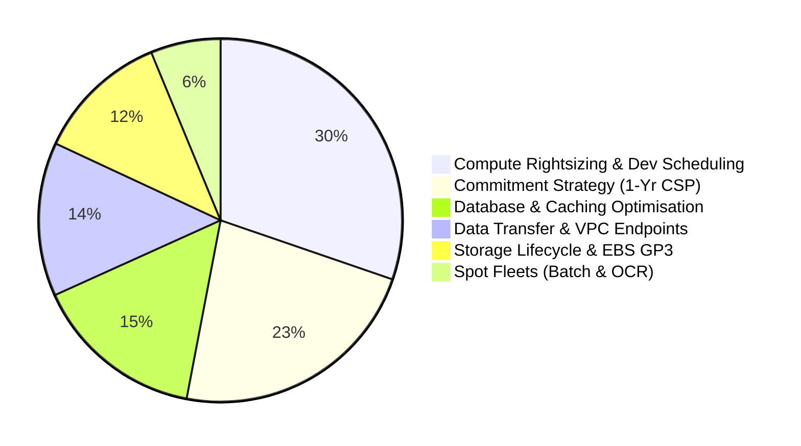

# Infrastructure Cost Optimisation

> **Author** : Nihal N  
> **Track** : DevOps & Cloud Engineer  
> **Category** : Cost Optimisation  

---

## Executive Summary

- LendFlow Technologies is a fictional cloud-native fintech enterprise running 12 mission-critical microservices on AWS, primarily in ap-south-1 (Mumbai).
- AWS monthly costs increased from $50K to $180K (+260%), while cost per loan application rose 45.4% ($0.238 → $0.346), driven by over-provisioning, unmanaged environments, and zero commitment coverage.
- This project implements an end-to-end FinOps Framework and technical cost-remediation architecture under the direction of CFO Priya Menon and CTO Arjun Deshmukh, focused on improving AWS cost efficiency and scalability.

---

## Repository Deliverables & Navigation

```text
|
├── README.md                           # Master project documentation & FinOps overview
├── CHANGELOG.md                        # Chronological log of architectural decisions & milestones
│
├── docs/                               # Formal engineering & executive documentation
│   ├── cost-audit-report.md            # Comprehensive AWS cost audit & waste discovery report
│   ├── optimisation-recommendations.md # 16 prioritised recommendations with compliance assessments
│   ├── simulation-concept.md           # CLOUDBURN Gamified War Room Simulator business concept & badges
│   ├── case-studies.md                 # 4 industrial FinOps case studies ($2.4M shock, Razorpay, Neobank, Singapore)
│   ├── stakeholder-priority-matrix.md  # 6-persona executive priority matrix & conflict governance
│   ├── auto-scaling-policies.md        # Asymmetric & scheduled auto-scaling architectures
│   ├── ri-spot-strategy.md             # Savings Plans, Reserved Instance & Spot procurement strategy
│   ├── tagging-taxonomy.md             # 10-tag mandatory taxonomy & 4-layer enforcement model
│   ├── governance-model.md             # RACI matrix, multi-tier budgets & FinOps operating cadences
│   ├── anomaly-detection.md            # Multi-layer anomaly detection framework & investigation runbook
│   └── review-process.md               # Monthly/quarterly review processes & FinOps maturity framework
│
├── analysis/                           # Mathematical models & financial workbooks
│   ├── billing-analysis.xlsx           # 12-month billing trend, Pareto analysis & unit economics
│   └── savings-model.xlsx              # Multi-tab financial savings model (Summary, Compute, DB, etc.)
│
├── dashboards/                         # Publication-quality interactive dashboard mockups & simulator
│   ├── simulation-war-room.html        # Interactive CLOUDBURN Gamified War Room Simulator (Campaign, Arena, Sandbox)
│   ├── executive-dashboard.html        # CFO/CTO executive strategic cost dashboard
│   ├── engineering-dashboard.html      # Engineering Manager / Platform efficiency dashboard
│   └── team-dashboard.html             # Microservice & team-level unit cost dashboard
│
├── policies/                           # Policy-as-Code & infrastructure guardrails
│   ├── scp-mandatory-tags.json         # AWS Service Control Policy: Mandatory Tag Enforcement
│   ├── scp-gpu-restriction.json        # AWS Service Control Policy: Restrict Expensive GPU Instances
│   ├── scp-region-restriction.json     # AWS Service Control Policy: Region Boundary Guardrail
│   ├── scp-instance-cap.json           # AWS Service Control Policy: Max Instance Size & Count Controls
│   ├── config-rules.yaml               # AWS Config Rules: Untagged resources, idle instances, storage
│   ├── auto-scaling-loan-api.json      # Production Loan API Auto Scaling Group configuration
│   ├── auto-scaling-batch-ocr.json     # KYC OCR 80% Spot Fleet Auto Scaling configuration
│   ├── auto-scaling-scheduled-dev.json # Dev/Staging 9am-7pm weekdays scheduled scaling actions
│   └── terraform-cost-module/          # Reusable Terraform cost governance module with Infracost
│       ├── main.tf                     # Standard 10-tag mapping and launch template resources
│       ├── variables.tf                # Input validation with strict HCL regex rules
│       ├── outputs.tf                  # Module output variables
│       └── infracost.yml               # CI/CD pull request cost gate ($500/mo overrun blocker)
│
├── presentation/                       # Executive board & CFO review materials
│   ├── cfo-presentation.md             # 20-slide executive CFO review presentation transcript
│   └── cfo-presentation.html           # Interactive, high-impact HTML5 presentation deck
│
├── daily-logs/                         # Daily engineering logs across 15-day lifecycle
│   ├── day-01.md through day-15.md     # Substantive day-by-day logs of discoveries and decisions
│
├── scripts/                            # Analysis reproduction & validation scripts
│   ├── generate_datasets.py            # Generates all 8 mathematical simulated CSV datasets
│   ├── build_billing_analysis.py       # Builds analysis/billing-analysis.xlsx
│   ├── build_savings_model.py          # Builds master analysis/savings-model.xlsx
│   ├── append_storage_datatransfer.py  # Appends Storage & Data Transfer sheets
│   ├── append_commitment_spot.py       # Appends Commitment & Spot analysis sheet
│   └── verify_cross_references.py      # Automated QA cross-reference & consistency tester
│
└── data/                               # Auditable simulated datasets
    ├── monthly_cost_summary.csv        # 12-month billing history ($50k to $180k)
    ├── daily_cost_detail.csv           # 30-day granular service spend & application volumes
    ├── instance_utilisation.csv        # EC2 CPU/RAM telemetry, runtime hours, and sizing flags
    ├── storage_inventory.csv           # S3, EBS, and snapshot inventory with access patterns
    ├── data_transfer_log.csv           # Cross-AZ, internet egress, and NAT gateway transfer flows
    ├── reserved_instance_coverage.csv  # Baseline commitments, RI/SP pricing, and coverage gap
    ├── tag_compliance_report.csv       # Tagging audit across 150+ resources & dark spend
    └── cost_anomaly_events.csv         # 10 historical anomaly incidents and root cause analyses
```

---

## Primary Cost Reduction Drivers ($64,250.00 / Month Total)



1. **Compute Fleet Rightsizing & Non-Production Scheduling ($19,450/month):** Downsizing 28 instances running under 20% CPU ([Rec 03](docs/optimisation-recommendations.md#recommendation-03-right-size-over-provisioned-production-compute-instances)); terminating abandoned test sandboxes ([Rec 09](docs/optimisation-recommendations.md#recommendation-09-immediate-termination-of-abandoned-sandboxes)); automatically shutting down Development and Staging fleets outside business hours (9 AM - 7 PM weekdays), capturing 69.4% idle runtime reduction ([Rec 02](docs/optimisation-recommendations.md#recommendation-02-implement-automated-non-production-scheduling)).
2. **Commitment Strategy — 1-Year Compute Savings Plans ($14,600/month):** Committing 75% of steady-state post-rightsizing production compute to 1-Year Partial Upfront Compute Savings Plans with a 38.4% blended discount, full portability across instance families, and a rapid 1.23-month cash payback ([Rec 04](docs/optimisation-recommendations.md#recommendation-04-procure-1-year-partial-upfront-compute-savings-plans)).
3. **Database Architecture & Replica Consolidation ($9,800/month):** Downgrading staging RDS to Single-AZ Graviton `db.t4g.large`, decommissioning idle production reporting read-replicas in favor of an Athena/S3 lake, rightsizing ElastiCache clusters, and purchasing 1-Year RDS RIs ([Rec 07](docs/optimisation-recommendations.md#recommendation-07-database-rightsizing--read-replica-consolidation)).
4. **Data Transfer & S3 Gateway Endpoints ($8,800/month):** Eliminating $0.045/GB Public NAT Gateway data processing fees on internal S3 downloads via free AWS S3 Gateway VPC Endpoints ([Rec 01](docs/optimisation-recommendations.md#recommendation-01-deploy-aws-s3-gateway-vpc-endpoints)); enforcing Availability Zone routing affinity ([Rec 10](docs/optimisation-recommendations.md#recommendation-10-inter-service-cross-az-traffic-optimisation)).
5. **Storage Lifecycle & EBS Modernisation ($7,600/month):** Moving 145 TB of dormant KYC loan docs (>90 days inactive) from S3 Standard to Glacier Instant Retrieval ([Rec 05](docs/optimisation-recommendations.md#recommendation-05-s3-lifecycle-configuration-for-dormant-loan-documents)); deleting 7,500 GB of orphan unattached EBS disks ([Rec 06](docs/optimisation-recommendations.md#recommendation-06-purge-orphaned-unattached-ebs-volumes)); converting GP2 to GP3 ([Rec 11](docs/optimisation-recommendations.md#recommendation-11-migrate-attached-ebs-volumes-from-gp2-to-gp3)); enforcing 30-day snapshot lifecycles ([Rec 13](docs/optimisation-recommendations.md#recommendation-13-enforce-aws-dlm-snapshot-30-day-retention-policy)).
6. **Spot Fleet Orchestration ($4,000/month):** Transitioning asynchronous, queue-backed batch processing (KYC OCR document extraction, daily credit risk simulations) to diversified Spot fleets with 20% on-demand base and sub-minute S3 checkpointing ([Rec 08](docs/optimisation-recommendations.md#recommendation-08-spot-fleets-for-kyc-ocr--batch-analytics)).

---

## Compliance Guardrails & Governance Safeguards

Every single optimisation measure has undergone formal Compliance Impact Assessment:
* **PCI DSS v4.0:** Payment Gateway microservices retain dedicated Multi-AZ compute in isolated VPC subnets; **100% excluded from Spot instances**.
* **SOC 2 Type II:** All audit, access, and transaction logs are transitioned to compliant Glacier storage with **S3 Object Lock (Compliance WORM)** enabled; zero deletion of compliance records.
* **RBI IT Framework:** Core banking and lending databases strictly maintain synchronous Multi-AZ primary/standby replication within Mumbai (`ap-south-1`).
* **GDPR & Data Localisation:** Cross-border data transfers are strictly restricted. Customer Personal Identifiable Information (PII) remains within Indian geographic boundaries.
---
<div align="center">

# 👨‍💻 Author

## **Nihal N**

**DevOps • Cloud • Kubernetes**

[](https://www.linkedin.com/in/nihal-n-cse/)
---


## If you found this Project useful, consider giving it a ⭐!

</div>
