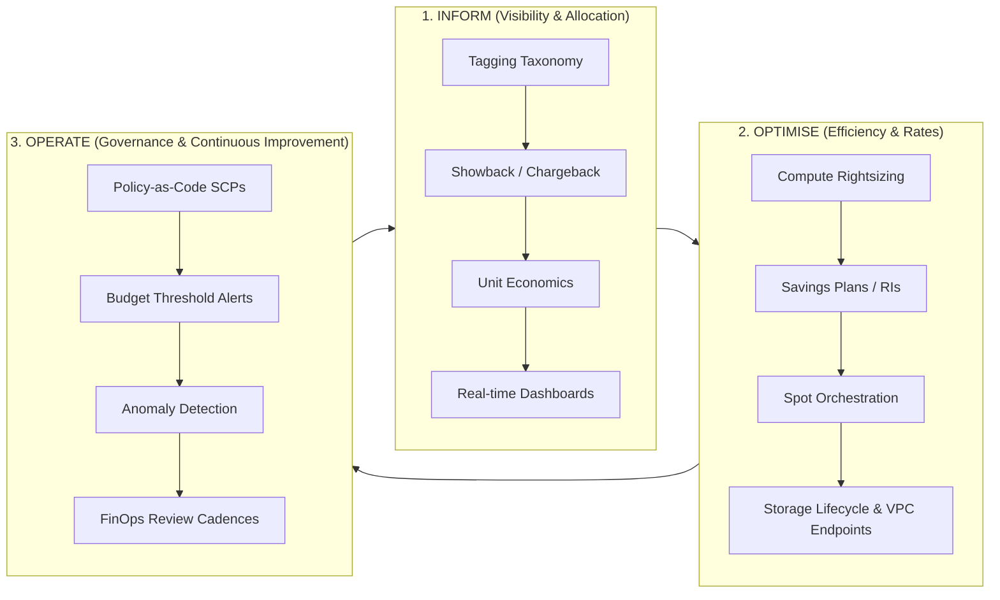

# Day 1: FinOps Foundations & Dataset Familiarisation

**Date:** Execution Stage 1 (Baseline Day 1)  
**Author:** Senior FinOps Engineer & Cloud Architect  
**Status:** Completed  

---

## 1. Executive Summary & Context

LendFlow Technologies is a high-growth cloud-native fintech enterprise processing over 500,000 loan applications monthly across 12 microservices on AWS (primarily `ap-south-1`). Over the past 12 months, AWS expenditure has spiralled out of control from **$50,000/month to $180,000/month** (+260% increase), while gross platform revenue only doubled (+100%).

The primary business directive mandated by CFO Priya Menon is to achieve a **minimum 33% cost reduction (at least $60,000/month in net savings)** within 90 days, returning cloud spend to <= $120,000/month without degrading the 99.95% availability SLA, engineering velocity, or regulatory compliance posture (PCI DSS v4.0, SOC 2 Type II, RBI IT Framework, GDPR, and Indian Data Localisation mandates).

---

## 2. FinOps Lifecycle Architecture: Inform → Optimise → Operate

To transition LendFlow from reactive cost panic to sustainable financial engineering, we establish the FinOps Foundation's three-phase operating model:



1. **INFORM:** Gain granular visibility into cloud consumption. Eliminate "dark spend" ($75,000+ untagged), establish 10 mandatory allocation tags, produce team-level showback reports, and benchmark unit economics ($/loan application).
2. **OPTIMISE:** Eliminate architectural waste. Right-size overprovisioned EC2 and RDS instances, schedule non-production environments (9 AM to 7 PM weekdays), route S3 and DynamoDB traffic through Gateway VPC Endpoints, apply automated S3 lifecycle tiers, and commit steady-state workloads to 1-Year Compute Savings Plans.
3. **OPERATE:** Implement policy-as-code guardrails (Service Control Policies, AWS Config rules, Terraform pre-commit checks with Infracost) and institutionalize review cadences across engineering and executive leadership.

---

## 3. AWS Well-Architected Framework: Cost Optimisation Pillar

Our analytical framework adheres strictly to the AWS Well-Architected Cost Optimisation Pillar:

1. **Practice Cloud Financial Management:** Establish cross-functional collaboration between engineering, finance, and product.
2. **Adopt a Consumption Model:** Stop paying for idle non-production environments 24/7; spin resources down when not in use.
3. **Measure Overall Efficiency:** Track cost per loan application rather than gross infrastructure spend alone.
4. **Stop Spending Money on Undifferentiated Heavy Lifting:** Leverage native AWS services (S3 Intelligent-Tiering, Gateway Endpoints, Auto Scaling) instead of custom unmaintained scripts.
5. **Analyse and Attribute Expenditure:** Implement strict tagging governance so 100% of cloud resources have an identifiable owner and cost centre.

---

## 4. Stakeholder Priority Matrix & Conflict Governance

A critical challenge in fintech cost optimisation is managing conflicting executive priorities. The matrix below defines each persona, their primary objective, risk sensitivity, and the required governance trade-off:

| Stakeholder | Role | Primary Priority | Risk Sensitivity | FinOps Alignment Strategy |
| :--- | :--- | :--- | :--- | :--- |
| **Priya Menon** | Chief Financial Officer (CFO) | Reduce AWS spend by 33%+ ($60,000/month) in 90 days; enforce budget predictability. | Financial variance, commitment lock-in. | Provide transparent monthly forecasts, ROI on Savings Plans, unit economic tracking, and weekly showback reports. |
| **Arjun Deshmukh** | Chief Technology Officer (CTO) | Maintain platform availability (99.95% SLA), fault tolerance, and architectural scalability. | Availability degradation, operational fragility. | Maintain Multi-AZ database topology for RBI compliance; enforce conservative scale-in thresholds and graceful draining. |
| **Ravi Krishnan** | VP of Engineering | Protect developer velocity, deployment frequency, and minimize engineering disruption. | Dev bottlenecks, complex manual approvals. | Automate dev/staging schedules with self-service Slack overrides; enforce guardrails seamlessly in CI/CD via Infracost. |
| **Meera Iyer** | Head of Compliance | Zero audit findings across PCI DSS v4.0, SOC 2 Type II, and RBI IT Framework. | Regulatory breaches, cross-tenant leaks, log loss. | Exclude PCI payment vaults from Spot instances; maintain SOC 2 audit log retention via immutable Glacier tiers. |
| **Sanjay Patel** | Head of Data Engineering | Maintain high-throughput ML pipelines and feature store latency for loan underwriting. | Data pipeline delays, memory starvation. | Migrate asynchronous batch ETL and model training to diversified Spot fleets with checkpointing; isolate prod scoring. |
| **Anita Sharma** | Product Manager | Rapid time-to-market for new credit products without impacting user-facing latency. | Customer checkout friction, loan drop-offs. | Implement asymmetric auto-scaling with proactive pre-warming for salary day spikes (1st & 15th of month). |

---

## 5. Exploratory Data Analysis (EDA): 12-Month Billing Trend

An exploratory analysis of `data/monthly_cost_summary.csv` reveals clear structural decay in spending discipline:

```text
Month-over-Month Billing Progression:
Month 01 (2025-10): $ 50,000.00  | Budget: $ 52,000.00 | Variance: -$ 2,000.00 (Under budget)
Month 03 (2025-12): $ 61,000.00  | Budget: $ 58,000.00 | Variance: +$ 3,000.00 (+5.2%)
Month 06 (2026-03): $ 98,000.00  | Budget: $ 71,000.00 | Variance: +$27,000.00 (+38.0%)
Month 09 (2026-06): $141,000.00  | Budget: $ 85,000.00 | Variance: +$56,000.00 (+65.9%)
Month 12 (2026-09): $180,000.00  | Budget: $ 95,000.00 | Variance: +$85,000.00 (+89.5%)
```

### Key Statistical Findings:
1. **Compounded Monthly Growth Rate (CMGR):** Monthly expenditure expanded at an average rate of **12.2% MoM**, compared to loan application volume growth of only **8.6% MoM**.
2. **Budget Divergence:** While the budget grew cautiously from $52,000 to $95,000 (+82.7%), actual spending accelerated from $50,000 to $180,000 (+260.0%), generating a monthly budget overrun of **+$85,000.00 (+89.5%)** in Month 12.
3. **Unit Economics Degradation:**
   - Month 1: $50,000 / 210,000 applications = **$0.238 per application**
   - Month 12: $180,000 / 520,000 applications = **$0.346 per application**
   - Unit cost worsened by **+45.4%**, proving that cloud spend is scaling super-linearly due to accumulated architectural inefficiency rather than organic business expansion.

### Fastest-Growing Cost Categories (Pareto Breakdown in M12):
1. **EC2 Compute ($61,200 / month - 34.0% of total):** Oversized c5.4xlarge and r5.4xlarge instances operating at <20% average CPU; dev and staging clusters running 24/7.
2. **RDS PostgreSQL ($39,600 / month - 22.0% of total):** Multi-AZ provisioned across all environments; idle staging read-replicas; unoptimised storage IOPS.
3. **Data Transfer ($21,600 / month - 12.0% of total):** Microservices communicating across availability zones without AZ affinity; NAT Gateway processing fees for intra-AWS S3 bucket downloads ($0.045/GB).
4. **S3 Object Storage ($19,800 / month - 11.0% of total):** Over 375 TB of uncompressed loan documentation, KYC images, and historical logs retained in S3 Standard with zero lifecycle policies.
5. **ElastiCache Redis ($12,600 / month - 7.0% of total):** Oversized clusters running in non-production with unbounded session key growth.

---

## 6. Outputs & Artefacts Produced
- Initialised Git repository with required directory tree: `docs/`, `analysis/`, `dashboards/`, `policies/`, `presentation/`, `daily-logs/`, and `data/`.
- Generated 8 mathematically consistent simulated datasets in `data/`:
  - `monthly_cost_summary.csv`
  - `daily_cost_detail.csv`
  - `instance_utilisation.csv`
  - `storage_inventory.csv`
  - `data_transfer_log.csv`
  - `reserved_instance_coverage.csv`
  - `tag_compliance_report.csv`
  - `cost_anomaly_events.csv`
- Built automated financial analysis workbook: `analysis/billing-analysis.xlsx`.
- Documented Stakeholder Priority Matrix and FinOps Governance Principles.

## 7. Next Logical Activity (Day 2)
Proceed immediately to **Day 2: Compute & Database Analysis**, evaluating instance-by-instance CPU/memory telemetry, non-production scheduling targets, RDS replica consolidation, and constructing the `Compute` and `Database` tabs in `analysis/savings-model.xlsx`.
