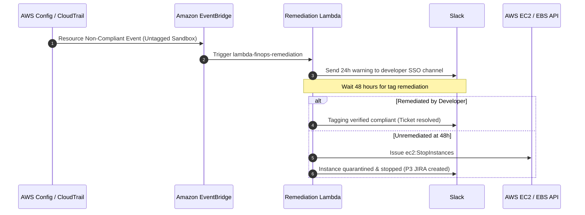

# Day 12: Policy-as-Code & Automation

**Date:** Execution Stage 12 (Baseline Day 12)  
**Author:** Senior FinOps Engineer & Cloud Architect  
**Status:** Completed  

---

## 1. Executive Summary

On Day 12, we codified LendFlow Technologies' cost governance into automated, enforceable **Policy-as-Code Assets** to prevent human configuration drift and guarantee that future architectural deployments remain cost-efficient by default.

We authored:
1. **Four AWS Service Control Policies (SCPs):**
   - Mandatory Tag Enforcement (`policies/scp-mandatory-tags.json`)
   - High-Cost GPU Launch Restrictions (`policies/scp-gpu-restriction.json`)
   - Approved Compliance Region Boundary (`policies/scp-region-restriction.json`)
   - Maximum Instance Size & Count Caps (`policies/scp-instance-cap.json`)
2. **AWS Config Conformance Pack (`policies/config-rules.yaml`):** Managed detective rules evaluating tag compliance, low-CPU utilization (<20%), storage lifecycles, and unattached EBS volumes.
3. **Reusable Terraform Cost Governance Module (`policies/terraform-cost-module/`):** Standardized module enforcing the 10-tag schema, instance type whitelist validation, and Infracost pull-request cost visibility.
4. **CI/CD Shift-Left Cost Gates (`policies/terraform-cost-module/infracost.yml`):** Automated PR checks that block any pull request increasing monthly spend by >$500 without prior CFO approval.

---

## 2. Policy-as-Code Specifications & Implementation

### 2.1 Service Control Policies (Preventive Enforcement)
Deployed at the AWS Organizations root, these policies operate outside linked-account administrator control:
* **GPU Launch Restriction (`scp-gpu-restriction.json`):** Denies `ec2:RunInstances` for P2, P3, P4, P5, G3, G4, G5, Inf1, and Trn1 instance families unless invoked by the vetted `LendFlowDataMLAdminRole`. Directly eliminates recurring $6,144/month GPU anomalies.
* **Approved Region Restriction (`scp-region-restriction.json`):** Restricts AWS operations to `ap-south-1` (Mumbai Primary), `eu-central-1` (Frankfurt), and `eu-west-1` (Ireland Partner Sync). Enforces Indian data localization and GDPR compliance boundaries at the API layer.
* **Instance Size Caps (`scp-instance-cap.json`):** Denies instances $>4\text{xlarge}$ in development, staging, and sandboxes, preventing accidental multi-thousand-dollar test clusters.

### 2.2 Reusable Terraform Cost Governance Module
Located in `policies/terraform-cost-module/`, this module encapsulates LendFlow's best practices:
* **`variables.tf`:** Employs HCL `validation` blocks with regex patterns ensuring valid business unit enums, NetSuite cost centers (`CC-101` to `CC-105`), and instance sizes.
* **`main.tf`:** Generates standard 10-tag mappings and attaches them across EC2 instances and EBS root/data volumes automatically.
* **`infracost.yml`:** Integrates directly into GitHub Actions / GitLab CI. Every pull request receives an automated comment displaying baseline monthly cost, projected new cost, and net dollar delta. PRs with a delta exceeding $500/month trigger an automated CI failure until reviewed by CFO Priya Menon.

---

## 3. Automated Remediation Workflow

---

## 4. Outputs & Artefacts Produced
- Authored production-ready, syntactically valid policy assets:
  - `policies/scp-gpu-restriction.json`
  - `policies/scp-region-restriction.json`
  - `policies/scp-instance-cap.json`
  - `policies/config-rules.yaml`
  - `policies/terraform-cost-module/main.tf`
  - `policies/terraform-cost-module/variables.tf`
  - `policies/terraform-cost-module/outputs.tf`
  - `policies/terraform-cost-module/infracost.yml`
- Documented findings in `daily-logs/day-12.md`.
- Updated `CHANGELOG.md`.

## 5. Next Logical Activity (Day 13)
Proceed immediately to **Day 13: CFO Review Panel Presentation**, constructing a professional, board-ready **15–20 slide CFO presentation deck** in `presentation/cfo-presentation.html` and `presentation/cfo-presentation.md`. Ensure 100% financial alignment with our Savings Model ($180,000 baseline, $64,250 net savings, $115,750 run-rate target) and provide the comprehensive 90-day implementation roadmap.
