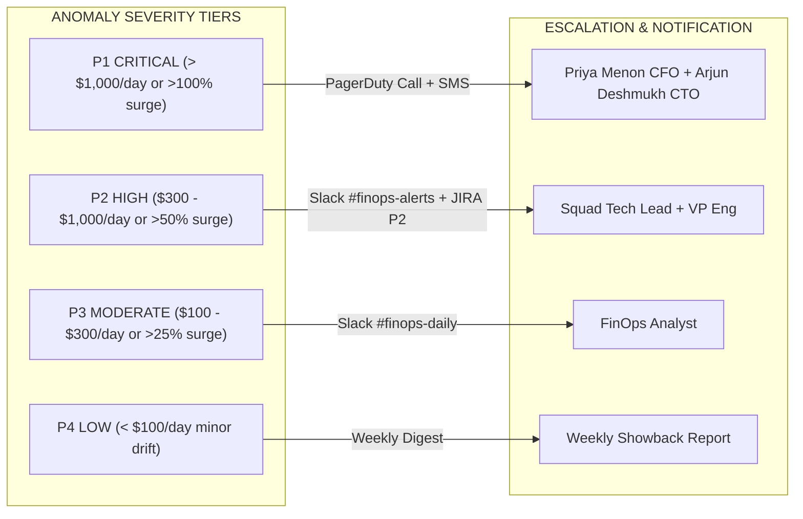
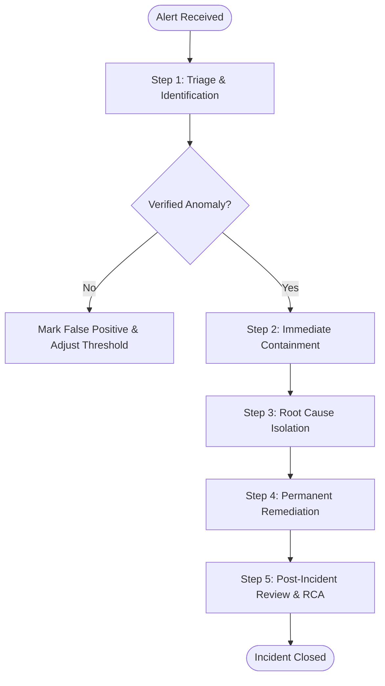

# LendFlow Technologies — Cost Anomaly Detection Framework & Operational Runbook

**Document Reference:** FINOPS-DOC-006  
**Classification:** Operational Architecture & Incident Response Standard  
**Primary Authors:** Senior FinOps Engineer, Cloud Architect, DevOps Lead  
**Approvals:** Priya Menon (CFO), Arjun Deshmukh (CTO), Ravi Krishnan (VP Eng)  
**Effective Date:** September 2026  

---

## 1. Executive Summary & Historical Anomaly Audit

Between April and September 2026, LendFlow Technologies experienced **10 severe cloud cost anomalies** documented in `data/cost_anomaly_events.csv`. In aggregate, these 10 incidents resulted in **$31,512.80 in pure financial waste**, with an unacceptably sluggish average Mean Time to Detection (MTTD) of **156.6 hours (6.5 days)**.

```text
Historical Anomaly Audit Highlights:
- Worst Incident: Abandoned p3.8xlarge GPU instance in dev ($6,144.00 wasted, 336 hours / 14 days undetected).
- Second Worst: KYC Service NAT Gateway egress surge after release ($4,600.00 wasted, 72 hours undetected).
- Third Worst: Payment service accidental DEBUG logging flood ($3,900.00 wasted, 60 hours undetected).
- Cumulative Waste: $31,512.80 across 6 months (~$5,250.00/month ongoing penalty).
```

### Correlation Findings:
* **Release Correlation (40%):** Code and Terraform deployments inadvertently altering network routing (e.g. dropping VPC endpoints), logging verbosity, or error retry loops.
* **Business Calendar Surges (30%):** False positive risk during salary-day lending surges (1st and 15th of the month) and quarter-end reporting runs.
* **Non-Production Drift (30%):** Performance load tests, experimental machine learning sandboxes, and orphan EBS volumes left running over weekends.

To reduce MTTD from **156 hours to <2 hours** and eliminate surprise billing spikes, this framework defines an integrated multi-layered detection engine, automated notification routing, and a step-by-step incident response runbook.

---

## 2. Evaluation of Anomaly Detection Methodologies

We evaluated five mathematical approaches to balance detection velocity against false-positive fatigue:

| Methodology | Mathematical Mechanism | Strengths | Limitations in Fintech Context | LendFlow Adoption Decision |
| :--- | :--- | :--- | :--- | :--- |
| **Static Thresholds** | Hard alerts (e.g. Daily Spend > $7,000) | Trivial to implement; zero computational overhead. | Incapable of distinguishing organic salary day spikes from waste; fails on micro-anomalies. | **Adopted as Safety Net (P1 Catastrophic)** |
| **Moving Average (SMA)** | Rolling 7-day average comparison | Smooths short-term day-of-week volatility. | Lags behind rapid step-function increases; slow recovery after spikes. | **Rejected in favor of EWMA** |
| **Statistical Z-Score / IQR** | $Z = \frac{x - \mu}{\sigma}$; flag if $|Z| > 3.0$ | Mathematically sound; handles normal variance dynamically. | Distorted by non-normal spend distributions and extreme salary day outliers. | **Adopted (Modified Z-Score using Median/MAD)** |
| **Isolation Forest (Unsupervised ML)** | Tree-based isolation of rare multi-dimensional feature points | Detects multivariate anomalies (e.g., normal cost but abnormal egress ratio). | Black-box explainability; requires continuous retraining on clean telemetry. | **Evaluated for Phase 3 (Run stage)** |
| **AWS Cost Anomaly Detection (ML)** | Proprietary ensemble algorithm evaluating historical trend & seasonality | Zero infrastructure to maintain; natively integrates with AWS Organizations. | ~24-hour evaluation cadence based on Cost and Usage Report (CUR) availability. | **Adopted as Layer 3 Strategic Audit** |

### The Chosen Hybrid Architecture:
LendFlow implements a **3-Tier Synchronous/Asynchronous Detection Hierarchy**:
1. **Tier 1 (Sub-Hour / Telemetry-Based):** CloudWatch Metric Alarms on infrastructure proxies (e.g., NAT Gateway bytes processed, CloudWatch log ingestion rate, EC2 running counts).
2. **Tier 2 (Daily / Statistical):** Lambda-driven Modified Z-Score on hourly billing telemetry with calendar-aware weighting for 1st/15th surges.
3. **Tier 3 (Daily / AWS ML):** Native AWS Cost Anomaly Detection monitors across Service, Account, and Cost Allocation Tag boundaries.

---

## 3. Anomaly Severity Matrix, SLAs & Escalation

Cost anomalies are classified into four severity tiers:



| Severity Tier | Financial Threshold Criteria | Notification Channels | Detection SLA (MTTD) | Acknowledgment SLA | Containment SLA (MTTR) | Mandatory Escalation Path |
| :--- | :--- | :--- | :--- | :--- | :--- | :--- |
| **P1 — Critical** | Projected impact **> $1,000 / day** OR **> 100% variance** vs 14-day baseline | PagerDuty FinOps Service (Phone Call/SMS) + Slack `#incident-bridge-p1` | **< 1 Hour** | **15 Minutes** | **< 2 Hours** | CFO (Priya Menon), CTO (Arjun Deshmukh), On-Call Lead |
| **P2 — High** | Projected impact **$300 – $1,000 / day** OR **> 50% variance** | Slack `#finops-alerts` + Urgent P2 JIRA Ticket | **< 4 Hours** | **1 Hour** | **< 6 Hours** | VP Eng (Ravi Krishnan), Relevant Squad Lead |
| **P3 — Moderate**| Projected impact **$100 – $300 / day** OR **> 25% variance** | Slack `#finops-daily-digest` + Standard JIRA Ticket | **< 12 Hours** | **4 Hours** | **< 24 Hours** | Assigned Squad Engineer, FinOps Analyst |
| **P4 — Low** | Projected impact **< $100 / day** | Weekly FinOps Showback Report | **< 24 Hours** | **Next Standup** | **Next Sprint** | Engineering Squad Lead |

---

## 4. Cost Anomaly Investigation Runbook

When an anomaly alert fires, the on-call engineer must follow this structured 5-step operational runbook:



### Step 1: Triage & Identification (Timeframe: 0 - 15 mins)
1. **Identify the affected resource ARN, service, account, and tag metadata.**
2. **Verify against scheduled business events:**
   - Is today the 1st or 15th (salary credit day surge)?
   - Was a scheduled marketing campaign launched?
   - Is a planned load test or data migration running?
3. If confirmed as legitimate business traffic, acknowledge alert, log note in `#finops-alerts`, and suppress further alerts for 12 hours.

### Step 2: Immediate Containment (Timeframe: 15 - 60 mins)
*Objective: Stop financial bleeding immediately without breaching production SLA.*
* **Abandoned Compute / GPU / Sandboxes:** Immediately issue `aws ec2 stop-instances` (or `terminate-instances` for untagged sandboxes).
* **Runaway S3 NAT Egress:** Temporarily attach AWS S3 Gateway Endpoint to the affected subnet route table:
  ```bash
  aws ec2 create-vpc-endpoint --vpc-id vpc-xxx --service-name com.amazonaws.ap-south-1.s3 --route-table-ids rtb-xxx
  ```
* **Debug Logging Flood:** Dynamically reduce log level to `INFO` via Spring Boot Actuator or ECS environment update without restarting pods:
  ```bash
  curl -X POST http://internal-payment-svc/actuator/loggers/com.lendflow -d '{"configuredLevel":"INFO"}' -H "Content-Type: application/json"
  ```
* **Runaway Batch Job:** Kill active Spark/EMR step and mark the parent Airflow DAG as failed.

### Step 3: Root Cause Isolation (Timeframe: 1 - 4 hours)
1. Correlate detection timestamp with **AWS CloudTrail** and Git deployment logs to identify the triggering commit or user principal.
2. Review CloudWatch metrics for preceding network or memory anomalies (e.g. cache eviction failure, infinite HTTP 500 retry loop).
3. Determine why preventive guardrails (SCPs / pre-commit checks) did not block the action.

### Step 4: Permanent Remediation
1. Merge bug fix to git repository (e.g. enforce SQS retry dead-letter queue limits, add TTL tags in Terraform).
2. Validate that spend metrics return to expected baseline trajectory.

### Step 5: Post-Incident Review (PIR) & RCA
Within 48 hours of any P1 or P2 incident, the responsible squad lead must publish an official Root Cause Analysis document detailing:
* **Financial Waste Total:** Exact dollar impact.
* **Timeline:** Detection time, acknowledgment time, containment time.
* **5 Whys Analysis:** Root cause chain.
* **Corrective Preventive Action:** Required policy-as-code or infrastructure change to guarantee the bug never recurs.
