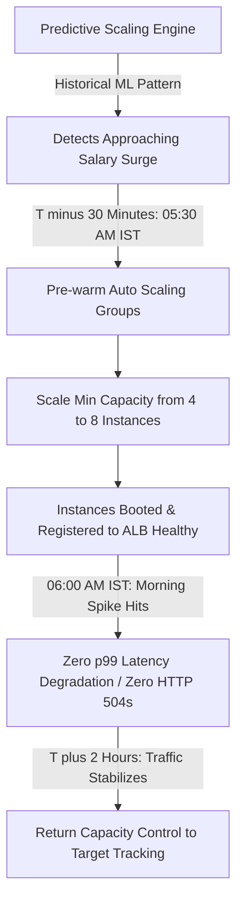

# LendFlow Technologies — Enterprise Auto-Scaling Architecture & Policies

**Document Reference:** FINOPS-DOC-008  
**Classification:** Technical Architecture & Automation Policy Specification  
**Lead Authors:** Senior FinOps Engineer, Principal Cloud Architect, Site Reliability Engineer  
**Stakeholder Approvals:** Arjun Deshmukh (CTO), Ravi Krishnan (VP Eng), Anita Sharma (Product Manager)  
**Effective Date:** September 2026  

---

## 1. Executive Summary & Design Principles

To eliminate over-provisioning while maintaining a strict **99.95% availability SLA**, LendFlow Technologies transitions from statically sized EC2 fleets to dynamic, elastic, and predictive auto-scaling.

Prior to this architecture, production services were provisioned to withstand theoretical 99th-percentile peak loads 24 hours a day, 7 days a week, resulting in an average CPU utilization of less than 20% across 68% of instances.

This document establishes:
1. **Asymmetric Scaling Mechanics:** Fast, aggressive scale-out combined with slow, conservative scale-in to prevent oscillation and latency spikes.
2. **Fine-Grained Policies for 6 Core Microservices:** Customized metric targets, thresholds, cooldowns, instance diversification, and Spot allocation percentages.
3. **Predictive Scaling Engine:** Calendar-aware scheduled pre-warming for salary-day lending surges (1st and 15th of the month) and month-end loan disbursements.
4. **Automated Non-Production Scheduling:** Deterministic scale-down of Development and Staging environments outside business hours (9:00 AM to 7:00 PM IST, Monday to Friday), recapturing **$8,200.00/month**.

---

## 2. Asymmetric Scaling Principles for Cloud-Native Fintech

In financial transaction processing, the cost of under-provisioning (dropped loan applications, failed payment authorizations, SLA breaches) drastically outweighs the marginal savings of premature scale-in. Therefore, LendFlow enforces **Asymmetric Scaling**:

```mermaid
graph TD
    subgraph ScaleOut["AGGRESSIVE SCALE-OUT (Immediate Response)"]
        SO1[Traffic Surge Detected] -->|Metric > Threshold for 1 minute| SO2[Add +50% Instances or Step Up +2]
        SO2 --> SO3[Scale-Out Cooldown: 60 Seconds]
        SO3 --> SO4[Fast Warm-up via Pre-baked AMIs]
    end

    subgraph ScaleIn["CONSERVATIVE SCALE-IN (Gradual Consolidation)"]
        SI1[Traffic Drops] -->|Metric < Threshold for 15 minutes| SI2[Remove 1 Instance or -10% Capacity]
        SI2 --> SI3[Scale-In Cooldown: 300 to 600 Seconds]
        SI3 --> SI4[Graceful Draining via Deregistration Delay]
    end
```



### Core Tenets:
* **Scale-Out Priority:** Trigger scale-out after just **1 consecutive evaluation period (60 seconds)**. Pre-warm container images and optimize application boot times to under 45 seconds using Amazon Linux 2023 minimal AMIs.
* **Scale-In Damping:** Require **15 consecutive minutes** of low utilization before executing a scale-in action. Terminate at most 1 instance per step to prevent thrashing during temporary traffic troughs.
* **Connection Draining (Deregistration Delay):** Elastic Load Balancers enforce a **60-second deregistration delay** allowing in-flight HTTP requests and database commits to complete before instance termination.

---

## 3. Microservice Auto-Scaling Policy Matrix

We engineered bespoke auto-scaling configurations across LendFlow's 6 core service tiers:

| Service Name | Primary Scaling Metric | Target Metric Value | Scale-Out Threshold & Action | Scale-In Threshold & Action | Cooldown (Out / In) | Min / Max Nodes | Instance Type | Spot Mix % | Regulatory & SLA Constraints |
| :--- | :--- | :--- | :--- | :--- | :--- | :--- | :--- | :--- | :--- |
| **1. Loan Application API** | `ALBRequestCountPerTarget` + `CPUUtilization` | 1,200 req/min per target & 60% CPU | CPU > 65% for 60s $\rightarrow$ Add +50% capacity (min 2 nodes) | CPU < 35% for 15m $\rightarrow$ Remove 1 node | 60s / 300s | 4 / 20 | `c5.2xlarge` | 0% (100% CSP) | Core user-facing ingress; 99.95% SLA; zero spot risk. |
| **2. Credit Scoring Engine** | `TargetTrackingAverageCPUUtilization` | 60% CPU | CPU > 65% for 60s $\rightarrow$ Add +2 instances | CPU < 35% for 15m $\rightarrow$ Remove 1 instance | 60s / 300s | 3 / 12 | `r5.2xlarge` | 0% (100% CSP) | High memory ML scoring; synchronous underwriting path. |
| **3. KYC Document Processing** | `ApproximateNumberOfMessagesVisible` (SQS) | 50 messages per instance | Backlog > 100 msgs $\rightarrow$ Add +3 instances | Backlog < 10 msgs $\rightarrow$ Remove 1 instance | 60s / 180s | 2 / 16 | `c5.2xlarge` (Pool: c5a, c6i, m5) | **80% Spot** (20% On-Demand) | Asynchronous SQS consumer; Node Termination Handler with S3 checkpointing. |
| **4. Payment Gateway Service** | `ALBRequestCountPerTarget` + `ActiveConnectionCount` | 800 req/min per target & 50% CPU | CPU > 55% for 60s $\rightarrow$ Add +2 instances | CPU < 30% for 20m $\rightarrow$ Remove 1 instance | 60s / 600s | 4 / 12 | `c5.2xlarge` | **0% Spot (Strict)** | **PCI DSS v4.0 CDE boundary; Multi-AZ; Spot strictly prohibited.** |
| **5. Reporting & Analytics ETL** | Scheduled Cron + `ApproximateNumberOfMessagesVisible` | SQS queue empty | SQS > 200 msgs $\rightarrow$ Scale from 0 to 6 workers | SQS = 0 for 10m $\rightarrow$ Scale down to 0 (Idle) | 60s / 120s | 0 / 8 | `r5.2xlarge` (Pool: r5a, r6i, m5) | **100% Spot** | Batch workload; auto-scales to 0 during business day. |
| **6. Notification Service** | `TargetTrackingAverageCPUUtilization` | 65% CPU | CPU > 70% for 60s $\rightarrow$ Add +1 instance | CPU < 30% for 15m $\rightarrow$ Remove 1 instance | 60s / 300s | 2 / 6 | `t3.medium` | 50% Spot | Push notifications, SMS OTPs, email notifications. |

---

## 4. Predictive Scaling for Salary-Day & Month-End Surges

Fintech lending platforms exhibit extreme, predictable calendar-driven spikes. At LendFlow:
* **1st & 2nd of Month:** Salary disbursement day for borrowers; traffic surges by **+135%** as users check pre-approved credit lines and initiate repayments.
* **14th – 16th of Month:** Mid-month salary cycles; traffic surges by **+115%**.
* **28th – 30th of Month:** Month-end financial reconciliation and closing.



### Scheduled AWS Auto Scaling Actions:
We configure AWS Auto Scaling scheduled actions in CloudFormation / Terraform:
```text
Scheduled Action: salary-day-prewarm-01st
- Recurrence: 30 0 1,15 * * (06:00 AM IST on 1st and 15th)
- Action: Update MinCapacity = 8, DesiredCapacity = 10 on loan-application-service
Scheduled Action: salary-day-cooldown-01st
- Recurrence: 30 14 2,16 * * (20:00 PM IST on 2nd and 16th)
- Action: Restore MinCapacity = 4, DesiredCapacity = 4
```

---

## 5. Non-Production Scheduled Auto-Scaling Architecture

To capture **$8,200.00/month in non-production compute savings**, all Staging and Development Auto Scaling Groups operate on an automated business-hours schedule:
* **Scale-Up (Morning):** Monday through Friday at **09:00 AM IST** (`0 3.5 * * 1-5` UTC) $\rightarrow$ Set `DesiredCapacity = MinCapacity = 1` per service.
* **Scale-Down (Evening):** Monday through Friday at **07:00 PM IST** (`30 13 * * 1-5` UTC) $\rightarrow$ Set `DesiredCapacity = MinCapacity = 0`.
* **Weekends:** Remainder at `0` capacity throughout Saturday and Sunday.

$$\text{Monthly Running Hours} = 10 \text{ hours/day} \times 22 \text{ weekdays} = 220 \text{ hours vs } 720 \text{ hours baseline (69.4\% reduction)}$$

### Self-Service Slack Override (`/lendflow-wake-env`):
If a developer requires an environment outside business hours, an interactive Slack command triggers an AWS Step Functions state machine that spins up the target environment for a requested duration (1 to 4 hours) and automatically scales it back down upon expiration.
