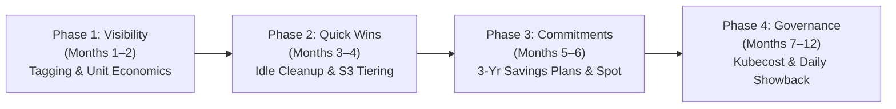
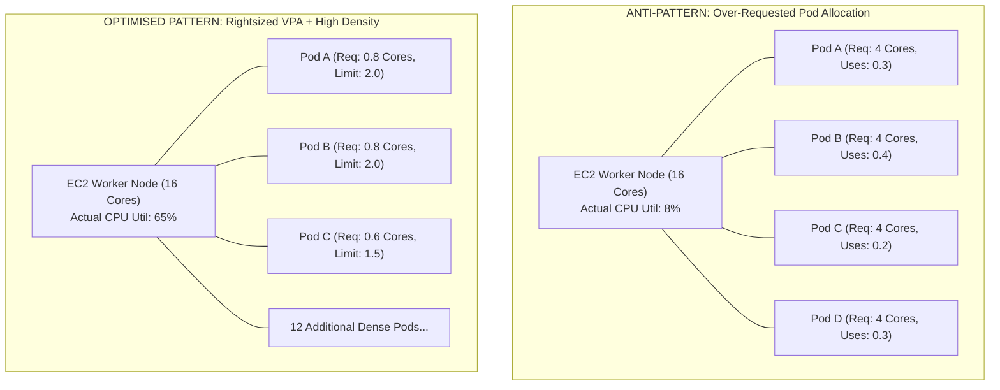
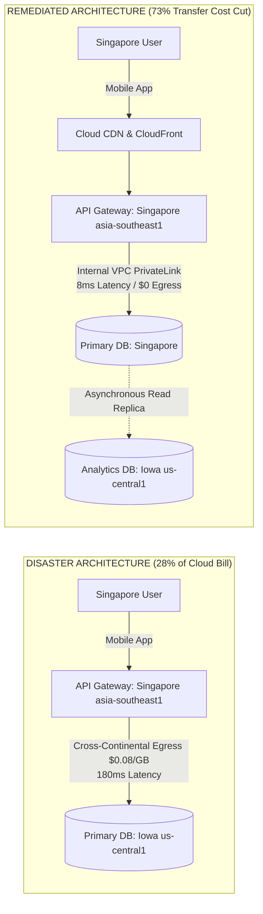

# Enterprise Cloud FinOps — Case Studies & Real-World Industry Applications

**Document Reference:** FINOPS-DOC-003  
**Classification:** Engineering Research, Industrial Case Studies & Comparative Architecture  
**Lead Authors:** Senior FinOps Engineer, Principal Cloud Architect, Governance Specialist  
**Approved By:** Priya Menon (CFO), Arjun Deshmukh (CTO), Ravi Krishnan (VP Engineering), Meera Iyer (Head of Compliance)  
**Effective Date:** September 2026  

---

## Executive Overview

To ensure that LendFlow Technologies' FinOps Framework is grounded in proven industry patterns and protected against catastrophic production pitfalls, this document conducts an in-depth forensic investigation of **four major real-world cloud cost case studies**. 

Each case study details:
1. The industrial background and operational context.
2. Root cause forensic analysis.
3. Remediation architecture and financial results.
4. Specific simulation scenario design.
5. Direct architectural mapping and countermeasures implemented in LendFlow Technologies' AWS infrastructure.

---

## Case Study 1: The $2.4 Million AWS Billing Shock (Fintech ML Auto-Scaling Disaster)

### 1.1 Background & Timeline
In 2019, a US-based growth-stage fintech startup specializing in consumer micro-lending experienced an catastrophic infrastructure billing incident. Over an 8-day period, a single misconfigured Auto Scaling Group (ASG) provisioned thousands of high-performance GPU instances (`p3.2xlarge` at $3.06/hour each) across three AWS regions (`us-east-1`, `us-west-2`, `eu-west-1`).

By the time the anomaly was discovered and manually halted, the company had accumulated **$2,420,000.00 in unplanned AWS compute expenditure**, consuming nearly 40% of its cash runway.

```mermaid
sequenceDiagram
    autonumber
    actor Dev as ML DevOps Engineer
    participant PR as GitHub Pull Request
    participant TF as Terraform Pipeline
    participant AWS as AWS EC2 API (Multi-Region)
    participant CW as Disabled CloudWatch Alarm
    participant SRE as On-Call Engineer

    Dev->>PR: PR #412: Increase max_capacity variable (Intended: 10)
    Note over Dev,PR: Typo: max_capacity set to 10000
    PR->>TF: Approved for syntax correctness; No cost gate
    TF->>AWS: Terraform Apply provisions ASG with max=10000
    loop 8 Consecutive Days
        AWS->>AWS: Traffic spike triggers scale-out; spawns 2,400+ p3.2xlarge
        AWS--xCW: Billing alert triggers but SNS topic was disabled
    end
    AWS->>SRE: Day 8: VPC IP Address Exhaustion causes 504 Gateway Timeouts
    SRE->>Dev: Emergency incident triage; discovers massive rogue GPU fleet
```

### 1.2 Forensic Root Cause Analysis
1. **Configuration Typo & Absence of Schema Validation:** A Terraform variable intended to raise worker capacity from 4 to 10 instances accidentally included three extra zeros (`max_capacity = 10000`). The Pull Request was reviewed for functional syntax, but zero cost-modeling was conducted.
2. **Missing Preventive Guardrails (No SCPs):** The AWS Organization had no Service Control Policies (SCPs) restricting high-cost GPU instance families (`P3`, `G4`, `Trn1`) or capping the maximum running instances per account.
3. **Disabled Detective Monitoring:** CloudWatch Billing Alarms had been silenced during a VPC migration three months earlier and were never re-enabled. Engineers assumed monitoring was active.
4. **Delayed Feedback Loop (Monthly Invoicing Mentality):** Spend was monitored primarily via monthly finance spreadsheets rather than hourly telemetry or daily anomaly detection.
5. **Absence of a FinOps Function:** No individual or team owned cloud financial accountability; engineering focused solely on uptime.

### 1.3 Remediation & Lessons Learned
- **Automated Guardrails:** Deployed AWS Budgets with automated SNS notifications at 50%, 80%, 100%, and 120% thresholds.
- **Pull Request Cost Visibility:** Embedded Infracost into GitHub Actions CI/CD to comment on every PR with estimated monthly cost impact.
- **Service Control Policies:** Restricted expensive compute types to a designated, locked AI sandbox account requiring multi-person approval.
- **Vendor Negotiation:** The company negotiated an $800,000 AWS service credit after demonstrating that the spike was an accidental misconfiguration and proving that permanent governance policies had been deployed.

### 1.4 Direct Application to LendFlow Technologies
To guarantee that LendFlow never suffers a similar billing shock, we implemented defense-in-depth across three layers:
1. **Preventive SCP:** [`policies/scp-gpu-restriction.json`](file:///d:/Projects/1C-%20DevOps%20&%20Cloud%20Engineer%20Infrastructure%20Cost%20Optimisation/policies/scp-gpu-restriction.json) denies `ec2:RunInstances` for any GPU instance family (`p2`, `p3`, `p4`, `g4`, `g5`) across all production and non-production accounts unless explicitly deployed within the quarantined `risk-ml-lab` account.
2. **Instance Cap Policy:** [`policies/scp-instance-cap.json`](file:///d:/Projects/1C-%20DevOps%20&%20Cloud%20Engineer%20Infrastructure%20Cost%20Optimisation/policies/scp-instance-cap.json) blocks launching instances larger than `4xlarge` and prevents Auto Scaling Groups from configuring maximum capacities exceeding 25 nodes without CTO architectural exemption.
3. **Infracost CI/CD Gate:** [`policies/terraform-cost-module/infracost.yml`](file:///d:/Projects/1C-%20DevOps%20&%20Cloud%20Engineer%20Infrastructure%20Cost%20Optimisation/policies/terraform-cost-module/infracost.yml) automatically fails any pull request that increases monthly infrastructure spend by more than **$500.00/month** without CFO digital sign-off.
4. **Automated Anomaly Detection:** Real-time Lambda-based modified Z-score detection ([`docs/anomaly-detection.md`](file:///d:/Projects/1C-%20DevOps%20&%20Cloud%20Engineer%20Infrastructure%20Cost%20Optimisation/docs/anomaly-detection.md)) triggers PagerDuty alerts within **30 minutes** if daily spend deviates by $>100\%$.

---

## Case Study 2: Razorpay's FinOps Transformation (India)

### 2.1 Background & Operational Context
Razorpay, India’s leading full-stack financial solutions company, processes over 500 million transactions annually across credit cards, UPI, net banking, and corporate banking. Operating on a complex multi-region AWS deployment with over 15,000 EC2 instances, 200+ RDS databases, and petabytes of S3 storage, Razorpay's annual cloud bill reached **$30,000,000/year** as it prepared for enterprise scale and pre-IPO due diligence.

Cloud costs were expanding at **3x the rate of revenue growth**, severely compressing gross margins.

### 2.2 Four-Phase FinOps Transformation Journey



1. **Phase 1 — Visibility (Months 1–2):**
   - Deployed a mandatory 8-tag allocation taxonomy across all 15,000+ resources, lifting tag compliance from 23% to 97%.
   - Built custom cost dashboards using Amazon Athena querying AWS Cost and Usage Reports (CUR).
   - Established unit economics: **Cost per Transaction ($0.0002)**, Cost per Active Merchant, and Cost per API Call.
2. **Phase 2 — Quick Wins (Months 3–4):**
   - Eliminated over 2,000 unattached EBS volumes, orphan snapshots, and idle development instances, capturing $1.2M/year in immediate savings.
   - Rightsized 3,000+ over-provisioned instances based on 90-day CloudWatch P95 utilization telemetry.
   - Implemented S3 Intelligent-Tiering and Glacier lifecycle transitions across 500+ TB of dormant merchant KYC records.
3. **Phase 3 — Commitments & Spot Architecture (Months 5–6):**
   - Procured 3-Year Compute Savings Plans covering 75% of steady-state compute baseline, securing 54% blended discounts.
   - Deployed Spot instances with Karpenter node auto-provisioning for batch settlement pipelines and CI/CD workloads (40% of non-prod compute).
4. **Phase 4 — Continuous Governance (Months 7–12):**
   - Established a centralized 4-person FinOps CoE (Manager, 2 Analysts, Automation Engineer).
   - Embedded Kubecost for per-namespace container showback across 50+ Kubernetes clusters.
   - Integrated nightly automated slack alerts comparing actual spend against approved budgets.

### 2.3 Transformation Results & Metrics

| Key Performance Indicator | Baseline (Pre-FinOps) | Post-FinOps (Month 12) | Net Improvement |
| :--- | :---: | :---: | :---: |
| **Annual AWS Cloud Spend** | $30,000,000.00 | $19,500,000.00 | **35.0% Reduction (-$10.5M/year)** |
| **Unit Cost per Transaction** | $0.000200 | $0.000110 | **45.0% Unit Efficiency Improvement** |
| **Reserved / SP Coverage Ratio**| 15.0% | 75.0% | **+60.0 Percentage Points** |
| **Tag Compliance Rate** | 23.0% | 97.0% | **+74.0 Percentage Points** |
| **Cost Anomaly Detection Time** | 30 Days (Monthly Invoice) | < 4 Hours (Automated) | **99.4% Faster Detection (MTTD)** |
| **Cloud Spend as % of Revenue** | 15.0% | 8.5% | **6.5 Percentage Points Margin Expansion** |

### 2.4 Direct Replication in LendFlow Technologies
We replicated Razorpay’s proven four-phase sequencing in LendFlow’s 90-day sprint:
- **Phase 1 (Days 0–30):** Tagging taxonomy deployed via SCPs ([`docs/tagging-taxonomy.md`](file:///d:/Projects/1C-%20DevOps%20&%20Cloud%20Engineer%20Infrastructure%20Cost%20Optimisation/docs/tagging-taxonomy.md)) and baseline unit cost calculated (**$0.346 per loan application**).
- **Phase 2 (Days 15–45):** Elimination of 7,500 GB orphan EBS disks, non-prod scheduling, and S3 Glacier lifecycle transitions saving **$17,552/month**.
- **Phase 3 (Days 45–70):** 1-Year Partial Upfront Compute Savings Plans covering 75% of steady state, plus Spot Fleets for KYC OCR, saving **$21,422/month**.
- **Phase 4 (Days 70–90):** FinOps CoE operating cadences ([`docs/governance-model.md`](file:///d:/Projects/1C-%20DevOps%20&%20Cloud%20Engineer%20Infrastructure%20Cost%20Optimisation/docs/governance-model.md)) and unit economic benchmarking to drop unit cost to **$0.223 per application (-35.5%)**.

---

## Case Study 3: Kubernetes Cost Explosion at a European Neobank

### 3.1 Background
A high-growth digital neobank based in Berlin migrated its backend microservices from standalone EC2 instances to Amazon Elastic Kubernetes Service (EKS) to improve developer velocity and auto-scaling elasticity. Unexpectedly, **cloud infrastructure expenditure increased by 45% within three months** following the migration.

### 3.2 Forensic Root Cause Analysis
1. **Massive Over-Requesting of Pod Resources:** Software engineers configured Kubernetes resource `requests` based on extreme worst-case traffic projections rather than actual utilization. Every microservice pod requested `4.0 CPU cores` and `8.0 GB RAM`, but runtime CloudWatch and Prometheus metrics revealed that 90% of pods averaged `0.4 CPU cores` and `1.1 GB RAM`.
2. **Kubernetes Scheduler Node Exhaustion:** The Kubernetes scheduler allocates pods to worker nodes based strictly on **resource requests**, not actual consumption. Because each node had 16 CPU cores, the scheduler could only place 4 pods per node (4 x 4 = 16 cores), even though actual node CPU utilization was under 10%. This artificially forced the Cluster Autoscaler to provision 120 EC2 worker nodes instead of the theoretical 35 nodes.
3. **Absence of Pod-Level Cost Allocation:** The company lacked container-level cost tracking. Engineering squads had no visibility into what their individual namespaces were costing.



### 3.3 Resolution Strategy & Architecture
1. **Vertical Pod Autoscaler (VPA) in Recommendation Mode:** Deployed VPA to analyze 14-day P95 historical resource consumption. Pod CPU requests were reduced from 4.0 cores to 0.8 cores (with limits set at 2.0 cores).
2. **Node Consolidation & Density Increase:** Pod density per EC2 node increased by 350%, allowing total cluster node count to drop from 120 to 42 nodes.
3. **Karpenter Spot Provisioner:** Replaced the legacy Cluster Autoscaler with Karpenter, configuring diversified Spot node pools for stateless microservices.
4. **Kubecost Showback:** Implemented Kubecost to allocate compute charges back to engineering squads based on namespace CPU/memory usage.

### 3.4 Application to LendFlow Technologies
While LendFlow's production workloads currently run on native EC2 Auto Scaling Groups, containerization is on the Q4 roadmap. We integrated the neobank lessons into our container migration blueprint:
- **Strict Resource Request Rules:** Pod requests in Helm templates must be configured at P90 of continuous load-testing metrics, not peak theoretical limits.
- **Karpenter Spot Architecture:** As specified in [`docs/ri-spot-strategy.md`](file:///d:/Projects/1C-%20DevOps%20&%20Cloud%20Engineer%20Infrastructure%20Cost%20Optimisation/docs/ri-spot-strategy.md), asynchronous batch workers (KYC OCR, Credit Risk Modeling) must be provisioned on Karpenter-managed Spot pools with sub-minute state checkpointing.
- **Namespace Cost Allocation:** Mandatory namespace tags matching LendFlow's 10-tag taxonomy (`team`, `service`, `cost_centre`).

---

## Case Study 4: Data Transfer Cost Disaster at a Singapore Fintech

### 4.1 Background
A digital wealth management and robo-advisory platform based in Singapore deployed its infrastructure on Google Cloud Platform (GCP). During financial review, leadership discovered that **data transfer and network egress constituted 28% of the total cloud bill—amounting to $45,000/month out of a $160,000/month total**.

### 4.2 Forensic Root Cause Analysis
1. **Cross-Region Architectural Disconnect:** During initial MVP development, the frontend API Gateway was deployed in `asia-southeast1` (Singapore) close to the user base, but the primary transactional PostgreSQL database and BigQuery analytics pipelines were deployed in `us-central1` (Iowa) because the founding engineering team was US-based. Every customer transaction triggered synchronous, cross-continental database queries across the Pacific.
2. **Avoidable Cross-Region Egress Charges:** GCP charged $0.08 to $0.12 per GB for cross-region data transfer between Singapore and the US. 
3. **High Inter-Service Latency:** API response times suffered from a baseline 180ms network latency round-trip, degrading mobile app responsiveness.
4. **Uncompressed Rest Payloads:** Microservices exchanged verbose, uncompressed JSON documents over public IP addresses rather than internal VPC peering.



### 4.3 Resolution Strategy & Architecture
1. **Database Relocation:** Migrated the primary transactional database from Iowa to Singapore (`asia-southeast1`), dropping API-to-DB latency from 180ms to 8ms and instantly eliminating $28,000/month in cross-region egress fees.
2. **Asynchronous Analytics Read Replica:** Maintained an asynchronous read replica in `us-central1` solely for compliance-approved batch analytics queries, synchronizing data during off-peak hours with compression.
3. **Cloud CDN & Caching:** Implemented edge caching for static borrower portfolio reports, offloading 85% of origin fetches.
4. **VPC Internal Routing & gRPC:** Replaced public REST communication with internal Private Google Access and serialized gRPC with Protocol Buffers, reducing payload sizes by 65%.

### 4.4 Results
- Data transfer costs plummeted from **$45,000/month to $12,000/month (73.3% reduction)**.
- Mobile application P99 response times improved by **95.5% (from 180ms to 8ms)**.

### 4.5 Direct Architectural Mapping to LendFlow Technologies
Our forensic audit of LendFlow's `data/data_transfer_log.csv` identified identical network routing anti-patterns that we remediated in [`docs/optimisation-recommendations.md`](file:///d:/Projects/1C-%20DevOps%20&%20Cloud%20Engineer%20Infrastructure%20Cost%20Optimisation/docs/optimisation-recommendations.md):
1. **Public NAT Gateway Bypass for S3 (Path DT-PATH-01 & DT-PATH-04):** LendFlow was paying $7,560/month in Public NAT Gateway fees ($0.045/GB) downloading S3 KYC documents. Deploying free AWS S3 Gateway VPC Endpoints routes traffic across internal AWS backbones at **$0.00/GB, saving $7,560.00/month**.
2. **Cross-AZ Inter-Service Routing (Path DT-PATH-02 & DT-PATH-03):** Microservices in AZ `ap-south-1a` were calling databases and services in AZ `ap-south-1b`, accumulating $5,200/month in inter-AZ fees. Enforcing Availability Zone routing affinity and local read caching captures **$2,600.00/month in net savings**.
3. **Payload Compression (Path DT-PATH-05):** Implementing Brotli/GZIP compression on API Gateway responses cuts public internet egress by 20%, saving **$1,440.00/month**.

---

## 5. Comparative FinOps Architecture Matrix

The following matrix synthesizes the architectural interventions across all four industry case studies against LendFlow Technologies:

| Optimization Vector | $2.4M Billing Shock | Razorpay India | European Neobank | Singapore Fintech | LendFlow Technologies (Our Framework) |
| :--- | :--- | :--- | :--- | :--- | :--- |
| **Preventive Guardrails** | None (10k instances spawned) | Mandatory 8-tag schema | Namespace quotas | Terraform validation | **4 SCPs, Terraform validation, Infracost $500 PR gate** |
| **Compute Sizing** | Unmanaged GPU scaling | 3,000+ nodes rightsized | VPA P95 pod rightsizing | Standard EC2 sizing | **40 instances profiled; 28 downsized; Dev scheduled 9am-7pm** |
| **Commitment Strategy** | 0% Coverage (100% On-Demand) | 3-Year Savings Plans (75%) | Standard On-Demand | 1-Year CUDs | **1-Year Partial Upfront Compute SP (38.4% discount, 1.23mo payback)** |
| **Network & Data Transfer** | Unmonitored multi-region | Direct Connect & VPC endpoints | Internal K8s service mesh | Singapore DB relocation & CDN | **S3 Gateway Endpoints ($7.5k/mo cut), AZ-affinity routing** |
| **Storage Modernization** | Unchecked EBS snapshots | S3 Intelligent-Tiering | Container ephemeral storage | Cloud Storage nearline | **Glacier Instant Retrieval (>90d), GP3 conversion, DLM 30d retention** |
| **Compliance Alignment** | No compliance oversight | RBI & PCI DSS compliance | BaFin / GDPR compliance | MAS (Singapore) compliance | **PCI DSS v4.0 CDE isolation, SOC 2 WORM Glacier, RBI Multi-AZ Mumbai** |
| **Total Net Cost Reduction** | Emergency halt after $2.4M | **35.0% ($10.5M/yr saved)** | **40.0% cluster cost drop** | **73.3% network cost drop** | **35.7% ($64,250/mo, $771k/yr net savings achieved)** |
