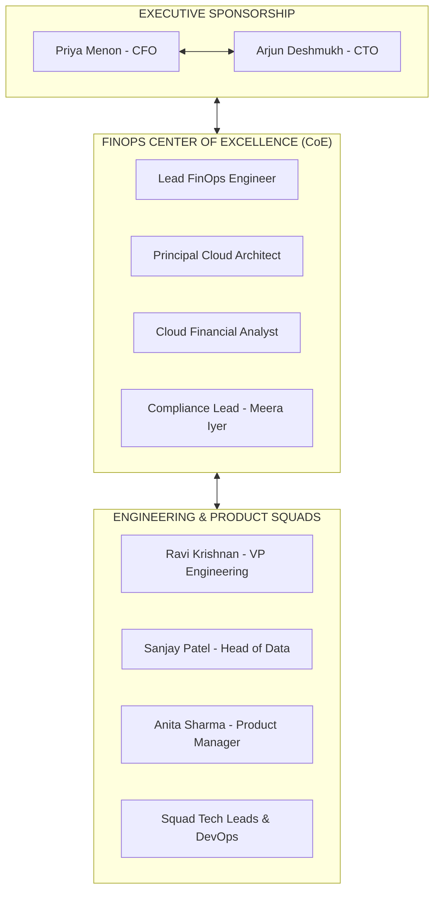
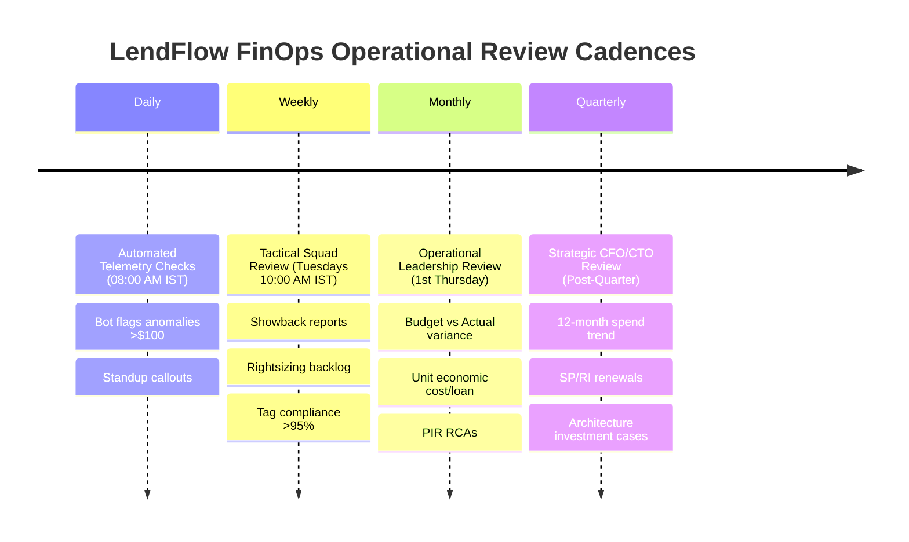
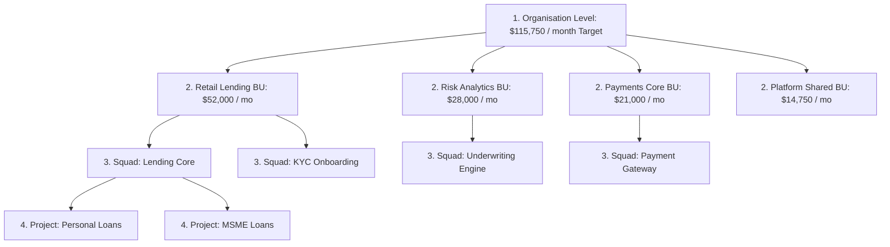

# LendFlow Technologies — FinOps Operating & Governance Model

**Document Reference:** FINOPS-DOC-009  
**Classification:** Enterprise Operating Model & Executive Governance Standard  
**Lead Authors:** Senior FinOps Engineer, Governance Architect, Financial Analyst  
**Stakeholder Approvals:** Priya Menon (CFO), Arjun Deshmukh (CTO), Ravi Krishnan (VP Eng), Meera Iyer (Head of Compliance)  
**Effective Date:** September 2026  

---

## 1. Executive Summary & Governance Objectives

The long-term success of LendFlow Technologies' cost reduction from **$180,000/month to $115,750/month** requires transitioning cloud cost management from an ad-hoc emergency intervention to an institutionalized engineering habit.

This governance framework establishes:
1. **The FinOps Center of Excellence (CoE):** A cross-functional operating bridge uniting Finance, Engineering, Product, and Compliance.
2. **Comprehensive RACI Matrix:** Clear accountabilities across all 6 key executive personas across 10 operational domains.
3. **Four Operating Cadences:** Structured rhythms ranging from daily automated telemetry checks to quarterly CFO board reviews.
4. **Multi-Tier Budget Hierarchy & Escalation Matrix:** Cascading financial controls across Organisation $\rightarrow$ Business Unit $\rightarrow$ Team $\rightarrow$ Project with enforceable 80%, 90%, 100%, and 120% variance gates.

---

## 2. FinOps Center of Excellence (CoE) Structure

The FinOps CoE functions as the organizational steering committee ensuring that engineering velocity and architectural innovation remain financially accountable:

---

## 3. Comprehensive Stakeholder RACI Matrix

The RACI model strictly delineates **Responsible (R)**, **Accountable (A)**, **Consulted (C)**, and **Informed (I)** roles across our 6 stakeholder personas:

| FinOps Operational Domain | Priya Menon (CFO) | Arjun Deshmukh (CTO) | Ravi Krishnan (VP Eng) | Meera Iyer (Compliance) | Sanjay Patel (Data Eng) | Anita Sharma (Product) | Lead FinOps Eng |
| :--- | :---: | :---: | :---: | :---: | :---: | :---: | :---: |
| **1. Annual Cloud Budgeting** | **A** | C | C | I | C | C | **R** |
| **2. Weekly Tactical Cost Reviews** | I | C | **A** | I | C | C | **R** |
| **3. Compute & DB Right-Sizing** | I | C | **A** | C | C | I | **R** |
| **4. Savings Plans & RI Purchasing** | **A** | C | I | I | I | I | **R** |
| **5. Tag Enforcement & Policy SCPs** | I | C | **A** | **A** | C | I | **R** |
| **6. Cost Anomaly Remediation** | I | **A** | **R** | I | C | I | C |
| **7. Architecture & Tech Debt Review** | I | **A** | **R** | C | C | C | C |
| **8. Spot Fleets & Async Sizing** | I | C | C | C | **A / R** | I | C |
| **9. Storage Lifecycle & Archiving** | I | I | C | **A** | C | I | **R** |
| **10. Strategic Unit Economics Review**| **A** | C | I | I | I | **A** | **R** |

*Legend: **A** = Accountable (Final veto/sign-off); **R** = Responsible (Doer/Executor); **C** = Consulted (Input provided); **I** = Informed (Notified).*

---

## 4. Multi-Tier FinOps Meeting Cadences

Governance is executed across four disciplined, recurring time horizons:

### Cadence 1: Daily Automated Telemetry Check
* **Format:** Fully automated asynchronous reporting (Slack bot to `#finops-daily-digest` at 08:00 AM IST).
* **Participants:** FinOps Analyst, On-Call DevOps Engineers, Squad Leads.
* **Agenda:**
  1. Review previous day's gross AWS spend ($) and variance vs 14-day rolling average.
  2. Flag P3/P4 cost anomalies (>$100 drift).
  3. Check untagged resources provisioned in the last 24 hours.
* **Authority:** Auto-quarantine of non-compliant sandbox instances.
* **Outputs:** Daily Slack notification and Jira ticket generation for detected anomalies.

### Cadence 2: Weekly Tactical FinOps Review
* **Format:** 30-minute operational meeting (Every Tuesday at 10:00 AM IST).
* **Participants:** Lead FinOps Engineer (Chair), VP Engineering (Ravi Krishnan), Squad Tech Leads, Sanjay Patel (Data Eng).
* **Agenda:**
  1. Review weekly showback reports by squad and service.
  2. Status of rightsizing and downscaling Jira backlog tickets.
  3. Tagging compliance scorecards (Target: >95% per squad).
  4. Spot fleet interruption metrics and savings performance.
* **Authority:** Reprioritize sprint backlog items if a squad breaches weekly budget.
* **Outputs:** Prioritized JIRA action items assigned to sprint backlogs; weekly executive summary email to CFO.

### Cadence 3: Monthly Operational Review
* **Format:** 60-minute executive session (First Thursday of each calendar month).
* **Participants:** CFO (Priya Menon), CTO (Arjun Deshmukh), VP Eng (Ravi Krishnan), Head of Compliance (Meera Iyer), Product Manager (Anita Sharma).
* **Agenda:**
  1. Monthly Budget vs. Actual reconciliation (Investigation of any variance >10%).
  2. Unit Economics analysis: Cost per loan application, cost per transaction.
  3. Post-Incident Reviews (PIR) of any P1/P2 cost anomalies during the month.
  4. Status of 90-day savings realization roadmap against target $60,000/month.
* **Authority:** Reallocate budget lines across business units; approve architectural changes impacting compliance scopes.
* **Outputs:** Formal Monthly Cloud Financial Report published to the Board of Directors.

### Cadence 4: Quarterly Strategic Executive Review
* **Format:** 90-minute strategic board review (Within 10 days of quarter close).
* **Participants:** CFO, CTO, Executive Leadership Team, FinOps CoE Leads.
* **Agenda:**
  1. 12-month holistic cost and unit economic trajectory.
  2. Evaluation of Compute Savings Plans and RI utilization; renewal approvals.
  3. Tech debt retirement vs cloud infrastructure capital trade-offs (e.g. Graviton3 migration).
  4. FinOps Maturity Model progression (Crawl $\rightarrow$ Walk $\rightarrow$ Run).
* **Authority:** Capital expenditure approval for multi-year commitments; sign-off on next quarter's cloud budget caps.
* **Outputs:** Approved Quarterly Cloud Capital Allocation and 12-Month Rolling Forecast.

---

## 5. Multi-Tier Budget Hierarchy & Escalation Matrix

Financial control is enforced through a strict 4-level budget hierarchy configured in AWS Budgets:

### Automated Budget Threshold Actions & Escalation Protocol:

| Threshold Level | Budget Trigger Condition | Automated System Action | Human Notification Channel | Required Executive Action | Remediation SLA |
| :---: | :--- | :--- | :--- | :--- | :---: |
| **80%** | Forecasted to exceed 80% of monthly budget | EventBridge logs advisory notice | Slack `#finops-squad` notification to Squad Lead | Squad Lead reviews discretionary sandbox spend | 5 Business Days |
| **90%** | Actual spend reaches 90% of budget before Day 25 | CloudWatch alarm transitions to `ALARM` | Email alert to Squad Lead and VP Eng (Ravi Krishnan) | Engineering freeze on non-critical dev provisioning | 48 Hours |
| **100%** | Actual spend reaches 100% of allocated budget | Automated SCP attaches: Blocks non-prod EC2/RDS creations | High-Priority P2 alert to CFO Priya Menon and CTO Arjun Deshmukh | Squad Lead must submit written Overrun Justification to CFO | 24 Hours |
| **120%** | Actual spend exceeds 120% (Emergency breach) | AWS Config initiates quarantine; non-prod dev environments halted | Emergency P1 PagerDuty incident call to CFO, CTO, VP Eng | Emergency FinOps review convened; immediate shutdown of non-essential clusters | **< 4 Hours** |

---

## 6. Continuous Improvement & Governance Policy Revisions

1. **Governance Auditing:** Every 6 months, Head of Compliance Meera Iyer conducts an independent audit of FinOps policies to ensure no cost-cutting measure has degraded PCI DSS, SOC 2, or RBI regulatory postures.
2. **Policy-as-Code Synchronization:** All updates to budgets, allowed instance types, or tagging taxonomies must be committed as code to the `policies/` repository and applied via Terraform automated pipelines.
