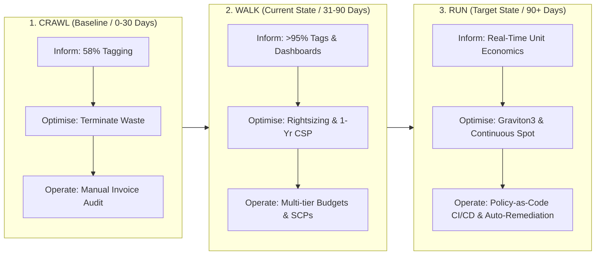

# LendFlow Technologies — FinOps Review Process, Maturity Framework & KPI/OKR Standard

**Document Reference:** FINOPS-DOC-011  
**Classification:** Enterprise Operating Standard & Executive Reporting Framework  
**Lead Authors:** Senior FinOps Engineer, Cloud Financial Analyst, Governance Lead  
**Stakeholder Approvals:** Priya Menon (CFO), Arjun Deshmukh (CTO), Ravi Krishnan (VP Eng), Anita Sharma (Product)  
**Effective Date:** September 2026  

---

## 1. Executive Summary

This standard operationalizes LendFlow Technologies' ongoing FinOps review cycles, defines the enterprise **FinOps Maturity Model (Crawl $\rightarrow$ Walk $\rightarrow$ Run)**, and establishes quantitative **Key Performance Indicators (KPIs) and Objectives & Key Results (OKRs)**.

By formalizing monthly report structures, quarterly strategic investment reviews, and multi-dimensional maturity milestones, LendFlow ensures that cloud financial efficiency becomes a permanent engineering discipline rather than a one-time cost reduction exercise.

---

## 2. Standard Monthly FinOps Report Package

On the 3rd business day of each month, the FinOps CoE publishes the formal **Monthly Cloud Financial Report** to CFO Priya Menon and the Executive Leadership Team. The report follows this mandatory 10-section structure:

### 1. Executive Summary
High-level summary of total AWS invoice spend, variance vs budget, net realised savings, and headline unit economics.
```text
Sample Monthly Summary:
- Actual Gross Spend:            $ 124,500.00
- Approved Budget:               $ 130,000.00
- Favorable Variance:            -$  5,500.00 (-4.2%)
- Cumulative Run-Rate Savings:   $  55,500.00 / month
- Active Microservices Monitored: 12
```

### 2. Budget vs. Actual Reconciliation Table
Granular reconciliation across all 4 Business Units and 12 Microservices.

### 3. Deep-Dive Explanations for Any Variance > 10%
Any squad or service deviating by more than $\pm 10\%$ from its monthly budget must submit an audited variance explanation:
* *Favorable Variance Example:* "KYC OCR Service ran 12% below budget due to 80% Spot Fleet adoption with zero capacity interruptions."
* *Unfavorable Variance Example:* "Risk Scoring Engine was 14% over budget due to pre-warming 4 extra instances during the unexpected September 25 festive campaign. Approved by Anita Sharma."

### 4. Top 5 Cost Drivers (Pareto Ranking)
Tracking gross spend and month-over-month trajectory across EC2, RDS, Data Transfer, S3, and ElastiCache.

### 5. Top 5 Business Growth Drivers
Correlating cloud spend increases with organic business drivers:
* New loan applications submitted (+12.4% MoM)
* Instant KYC identity checks processed (+18.2% MoM)
* Core banking disbursement settlements (+14.0% MoM)

### 6. Realised Savings Tracker vs. 90-Day Target ($64,250/mo)
Tracking realised monthly cash savings against our 16 recommendations.

### 7. Upcoming Month Execution Backlog
Specific rightsizing PRs, DLM snapshot retention rollouts, and Spot migrations scheduled for next month's engineering sprints.

### 8. Risk Management & Mitigations
Assessing risks that could threaten budget predictability (e.g. holiday campaign surges, Kafka partition rebalancing).

### 9. Savings Plans & Reserved Capacity Performance
* Overall Compute Savings Plan utilization rate (Target: $>95\%$).
* Commitment expiration pipeline (Tracking any RI or Savings Plan expiring within the next 90 days).

### 10. Compliance & Audit Verification
Formal sign-off by Head of Compliance Meera Iyer verifying that all storage lifecycle actions, subnet isolations, and data residency controls fully comply with PCI DSS v4.0, SOC 2 Type II, and RBI IT Framework rules.

---

## 3. Quarterly Strategic Executive Review Package

Every quarter, the FinOps CoE conducts a 90-minute strategic board review with CFO Priya Menon and CTO Arjun Deshmukh:
1. **12-Month Spend Trend & Macro Analysis:** Rolling quarterly spend trajectory compared to gross revenue growth.
2. **Comprehensive Unit Economics Review:** Tracking cost per loan application, cost per customer, and infrastructure gross margin.
3. **Commitment Strategy & Renewal Approvals:** Review of 1-Year vs 3-Year commitment performance and capital allocation sign-offs.
4. **Architecture Investment Business Cases:** Evaluating engineering investments that yield long-term cost reductions (e.g., migrating from x86 EC2 to **AWS Graviton3 (C7g/M7g)**, yielding an additional 20% price-performance gain).
5. **FinOps Maturity Scorecard:** Evaluating progress across the five organizational pillars.

---

## 4. FinOps Maturity Model: Crawl $\rightarrow$ Walk $\rightarrow$ Run

LendFlow evaluates its FinOps maturity across 5 operational capabilities:



| FinOps Capability Domain | Crawl Stage (Month 1 - 2) | Walk Stage (Current - Month 3) | Run Stage (Future - Month 6+) | Measurable Evaluation Criteria |
| :--- | :--- | :--- | :--- | :--- |
| **1. Cost Visibility & Allocation** | Basic monthly invoice review; 58% tagging; $75k unallocated dark spend. | 10-tag mandatory taxonomy; >95% tagging compliance; role-based dashboards in production. | Real-time automated unit cost telemetry; 100% spend allocated to squads; automated showback/chargeback. | % of spend allocated to General Ledger cost centres (>98%). |
| **2. Workload Optimisation** | Ad-hoc termination of obvious abandoned instances; manual rightsizing requests. | Automated dev/staging scheduling (9am-7pm); systematic fleet rightsizing; S3 lifecycle policies. | Continuous AI-driven automated rightsizing in CI/CD; automated container bin-packing; Graviton3 default. | Average fleet CPU utilization maintained between 55% and 65%. |
| **3. Rate & Commitment Optimisation** | 0% Reserved Instances; 0% Savings Plans; 100% On-Demand pricing. | 1-Year Compute Savings Plans covering 75% steady-state base; 1-Year RDS RIs. | Multi-tier laddered commitment strategy; automated Spot fleet orchestration for all batch workloads. | Commitment utilization >95%; effective blended discount >35%. |
| **4. Cloud Financial Governance** | Reactive CFO panic after monthly invoice overruns; zero budget alerts. | Cascading budget hierarchy (Org/BU/Team); 80/90/100/120% thresholds; weekly tactical reviews. | Policy-as-code guardrails blocking non-compliant Terraform PRs; automated Lambda remediation. | Budget variance maintained under $\pm 5\%$ monthly. |
| **5. Organizational Culture** | Cost is viewed solely as Finance's problem; engineers build for peak capacity. | Engineering managers track squad showback; cost optimisation included in sprint planning. | Unit cost ($/loan) treated as a first-class engineering metric alongside latency and availability. | Every production PR displays projected monthly cost delta via Infracost. |

---

## 5. Enterprise FinOps KPI & OKR Framework

To track continuous improvement, LendFlow adopts the following quantitative OKRs:

### Objective 1: Dramatically Improve Cloud Infrastructure Capital Efficiency
* **KR 1.1:** Reduce monthly AWS gross spend from **$180,000.00 to $\le$ $115,750.00** within 90 days (**$\ge$ 35.7% reduction**).
* **KR 1.2:** Achieve recurring annualized cost savings of at least **$771,000.00 / year**.
* **KR 1.3:** Maintain Compute Savings Plan and Reserved Instance utilization above **95.0%** every week.

### Objective 2: Optimize Fintech Unit Economics & Margins
* **KR 2.1:** Reduce infrastructure cost per loan application from **$0.346 to $\le$ $0.223** (**$\ge$ 35.5% unit economic efficiency gain**).
* **KR 2.2:** Reduce cost per API call on `loan-app-api` to below **$0.00050**.
* **KR 2.3:** Maintain infrastructure spend at less than **8.0% of gross fintech platform revenue**.

### Objective 3: Establish World-Class FinOps Governance & Visibility
* **KR 3.1:** Maintain mandatory tag compliance above **96.0%** across all production and non-production assets.
* **KR 3.2:** Reduce Mean Time to Detection (MTTD) for cost anomalies from **156 hours to < 2 hours**.
* **KR 3.3:** Achieve **100% zero audit findings** across PCI DSS v4.0, SOC 2 Type II, and RBI IT Framework assessments.
