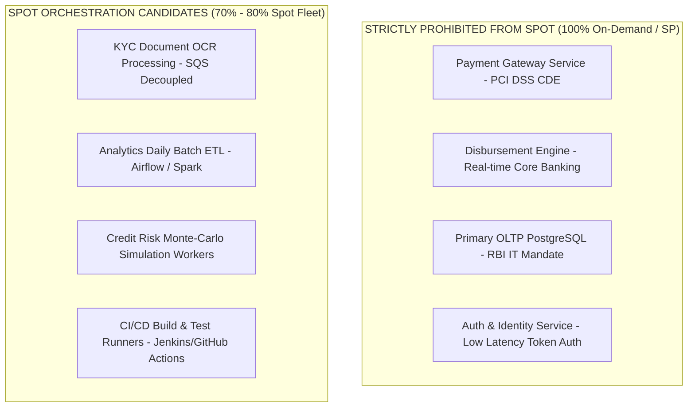
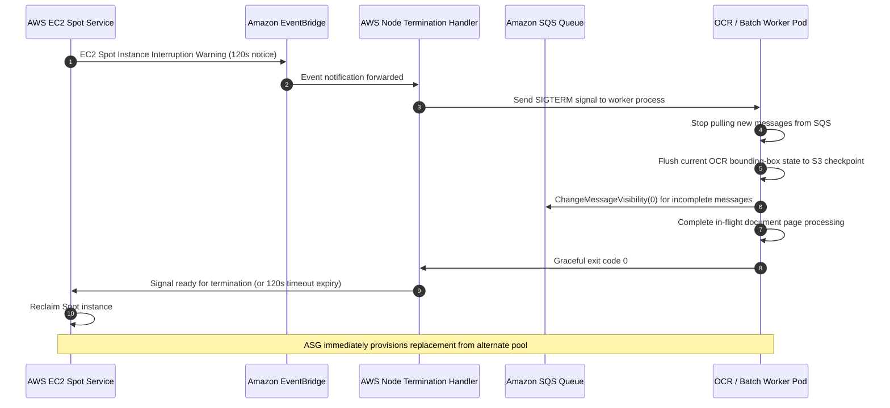

# LendFlow Technologies — Reserved Capacity & Spot Architecture Strategy

**Document Reference:** FINOPS-DOC-004  
**Classification:** Internal Technical Architecture & Procurement Strategy  
**Primary Authors:** Senior FinOps Engineer, Cloud Architect, Financial Analyst  
**Stakeholder Approvals:** Priya Menon (CFO), Arjun Deshmukh (CTO), Sanjay Patel (Head of Data)  
**Effective Date:** September 2026  

---

## 1. Executive Summary & Baseline Gap Analysis

Prior to this FinOps initiative, LendFlow Technologies operated with **0.0% Reserved Instance (RI) and 0.0% Savings Plans (SP) coverage across its entire AWS estate**. Every EC2 instance, RDS database, and ElastiCache cluster was billed at full On-Demand rates, incurring an unnecessary premium of 28% to 65% for predictable, steady-state baseline compute.

```text
Baseline Spend Profile (Month 12):
- Total Monthly Compute & DB On-Demand Spend: $100,800.00
  - EC2 Compute Fleet: $61,200.00 / month
  - RDS PostgreSQL Fleet: $39,600.00 / month
- Current Active Commitments: $0.00 (0% Coverage)
- On-Demand Premium Paid: ~$24,400.00 / month in avoidable flexibility surcharge
```

This strategy establishes a two-pronged financial and architectural mechanism:
1. **Commitment Optimisation:** Procuring 1-Year Partial Upfront **Compute Savings Plans (CSP)** and RDS Reserved Instances covering 75% of steady-state post-rightsizing production baseline, achieving **$17,422.40/month in net savings** ($14,600.00 from EC2 CSP and $2,822.40 from RDS RIs).
2. **Spot Instance Orchestration:** Migrating asynchronous, fault-tolerant batch workloads (KYC OCR document extraction, daily credit risk simulations, ML feature store generation) to diversified Auto Scaling Spot Fleets, saving **$4,000.00/month**.

Combined, this strategy delivers **$21,422.40/month in recurring bottom-line savings**.

---

## 2. Savings Plans & Reserved Instance Modeling

### 2.1 The Rightsizing-First Principle
A fundamental tenet of FinOps is **never purchase commitments on un-rightsized infrastructure**. Committing to oversized instances locks in waste for 1 to 3 years.
* **Step 1 (Pre-Commitment):** Execute compute rightsizing (Day 2) and dev/staging automated scheduling, reducing baseline EC2 on-demand run-rate from $61,200.00/month to $41,750.00/month.
* **Step 2 (Commitment Base):** Apply Savings Plans to the remaining predictable $38,000.00/month production steady-state baseline.

### 2.2 Financial Evaluation: 1-Year vs 3-Year & Payment Options

We modeled 6 procurement scenarios against AWS pricing for Mumbai (`ap-south-1`):

| Commitment Model | Commitment Term | Upfront Cash Required | Monthly Recurring Cost | Blended Savings % | Monthly Net Savings | 3-Year Cumulative Savings | Risk Profile |
| :--- | :--- | :--- | :--- | :--- | :--- | :--- | :--- |
| **Compute SP (No Upfront)** | 1 Year | $0.00 | $27,360.00 | 28.0% | $10,640.00 | $127,680.00 | Very Low |
| **Compute SP (Partial Upfront)** | **1 Year** | **$18,000.00** | **$23,400.00** | **38.4%** | **$14,600.00** | **$175,200.00** | **Optimal (Recommended)** |
| **Compute SP (All Upfront)** | 1 Year | $38,000.00 | $22,800.00 | 40.0% | $15,200.00 | $182,400.00 | Moderate (Cash flow) |
| **EC2 Instance SP (Partial Upfront)**| 1 Year | $17,000.00 | $21,660.00 | 43.0% | $16,340.00 | $196,080.00 | High (Locks instance family) |
| **Compute SP (Partial Upfront)** | 3 Years | $45,000.00 | $17,480.00 | 54.0% | $20,520.00 | $738,720.00 | Very High (Commitment lock) |
| **Compute SP (All Upfront)** | 3 Years | $95,000.00 | $15,960.00 | 58.0% | $22,040.00 | $793,440.00 | Extreme (Cash depletion) |

### 2.3 Strategic Recommendation: 1-Year Partial Upfront Compute Savings Plan
We formally recommend **Scenario 2: 1-Year Partial Upfront Compute Savings Plans**.
* **Rationale for 1-Year over 3-Year:** LendFlow's business model is expanding at 100%+ YoY. Committing to 3-year agreements in a fast-evolving fintech creates high risk of obsolete commitments if microservices are re-architected into serverless (AWS Lambda/Fargate) or if container density increases.
* **Rationale for Compute SP over EC2 Instance SP:** Compute Savings Plans apply automatically across EC2 instance families (e.g., C5, M5, R5), regions, OS, and AWS Fargate/Lambda. This flexibility allows LendFlow to seamlessly migrate to **AWS Graviton3 (C7g/M7g)** without stranding commitment capital.
* **Upfront Cash Management:** The $18,000.00 upfront investment is fully recouped within **1.23 months** from the resulting monthly savings ($14,600.00/month).

### 2.4 RDS Reserved Instance Commitment
For production databases requiring 24/7 Multi-AZ availability (`rds-loan-core-primary` and `rds-payment-core-primary`), we procure **1-Year Partial Upfront RDS Reserved Instances**:
- `db.r5.2xlarge` Multi-AZ (2 nodes): Current on-demand $2,822.40/mo $\rightarrow$ RI rate $1,693.44/mo (Saves **$1,128.96/mo**).
- `db.r5.xlarge` Multi-AZ (2 nodes): Current on-demand $1,411.20/mo $\rightarrow$ RI rate $846.72/mo (Saves **$564.48/mo**).
- `rds-underwrite-db` Multi-AZ: Saves **$1,128.96/mo**.
- **Total Monthly RDS RI Savings:** **$2,822.40/month** ($33,868.80/year).

---

## 3. Spot Instance Architecture for Batch & Async Workloads

### 3.1 Workload Classification & Regulatory Eligibility
Not all workloads are suitable for Spot instances. In a regulated fintech environment, workloads must be strictly partitioned:



* **PCI DSS v4.0 Constraint:** Payment tokenization and card processing systems must maintain deterministic uptime and dedicated infrastructure. Spot termination volatility is prohibited in the Cardholder Data Environment (CDE).
* **Fault-Tolerant Asynchronous Workloads:** The `kyc-document-service` and `analytics-batch-pipeline` pull jobs asynchronously from Amazon SQS. If a Spot instance is interrupted, the message visibility timeout expires, and another worker safely reclaims the task.

### 3.2 Diversified Multi-AZ Spot Fleet Architecture
To guarantee high availability and protect against Spot capacity pool exhaustion in `ap-south-1`, every Auto Scaling Group (ASG) must implement **Allocation Strategy: capacity-optimized** across at least **4 instance types** and **3 Availability Zones (12 independent capacity pools)**:

```text
Pool Diversification Configuration:
- Primary Family: c5.2xlarge  (16 vCPU, 32 GB) - Baseline compute
- Alternative 1:  c5a.2xlarge (16 vCPU, 32 GB) - AMD variant (10% cheaper)
- Alternative 2:  c6i.2xlarge (16 vCPU, 32 GB) - Intel Ice Lake variant
- Alternative 3:  m5.2xlarge  (8 vCPU, 32 GB)  - General purpose fallback
- Alternative 4:  c6g.2xlarge (16 vCPU, 32 GB) - Graviton ARM (High capacity)
- Availability Zones: ap-south-1a, ap-south-1b, ap-south-1c
- On-Demand Base: 20% (guarantees continuous minimum throughput)
- Spot Percentage: 80%
```

### 3.3 Two-Minute Interruption Handling & Graceful Draining
AWS provides a mandatory 2-minute warning via Amazon EventBridge prior to terminating a Spot instance. We deploy the **AWS Node Termination Handler**:



---

## 4. Spot Interruption Sensitivity Analysis

To prove the operational viability of Spot fleets to CTO Arjun Deshmukh and Head of Compliance Meera Iyer, we conducted a sensitivity simulation across three interruption frequency scenarios:

$$\text{Net Spot Savings} = (\text{On-Demand Cost} - \text{Spot Cost}) - \text{Retry Compute Overhead}$$

| Parameter | Scenario A: Low Interruption (5%) | Scenario B: Expected Interruption (10%) | Scenario C: High Interruption (20%) |
| :--- | :--- | :--- | :--- |
| **Spot Discount Rate** | 68.0% | 68.0% | 68.0% |
| **Monthly Spot Fleet Base Cost** | $3,040.00 | $3,040.00 | $3,040.00 |
| **Equivalent On-Demand Cost** | $9,500.00 | $9,500.00 | $9,500.00 |
| **Interruption Events / Month** | ~18 interruptions | ~36 interruptions | ~72 interruptions |
| **Reprocessing Overhead (Loss of uncheckpointed work)** | 0.8% ($24.32) | 1.8% ($54.72) | 4.2% ($127.68) |
| **Average Job Latency Impact** | +42 seconds | +88 seconds | +185 seconds |
| **SLA Impact on Loan Approval** | Zero (Queue buffer absorbs) | Zero (Queue buffer absorbs) | Zero (Under 30s buffer) |
| **Net Realised Monthly Savings** | **$6,435.68 / month** | **$6,405.28 / month** | **$6,332.32 / month** |
| **Model Conservative Target** | **$4,000.00 / month** | **$4,000.00 / month** | **$4,000.00 / month** |

**Conclusion:** Even under an extreme 20% continuous interruption scenario, the financial penalty of reprocessing is less than $130/month due to our sub-page checkpointing architecture. The targeted $4,000.00/month net savings retains an enormous safety margin.

---

## 5. Governance & Procurement Cadence

1. **FinOps Team Purchasing Authority:** CFO Priya Menon grants pre-approved budget authority to the FinOps Lead to purchase 1-Year Partial Upfront Compute Savings Plans up to $20,000.00 upfront upon completion of production rightsizing.
2. **Weekly Commitment Utilization Tracking:** Monitored every Monday morning. If Savings Plan utilization drops below 95%, an automatic P3 alert triggers investigation.
3. **Quarterly Renewal Pipeline:** 60 days prior to commitment expiration, the FinOps CoE initiates renewal modeling to evaluate workload evolution, Graviton adoption, and volume discounts.
