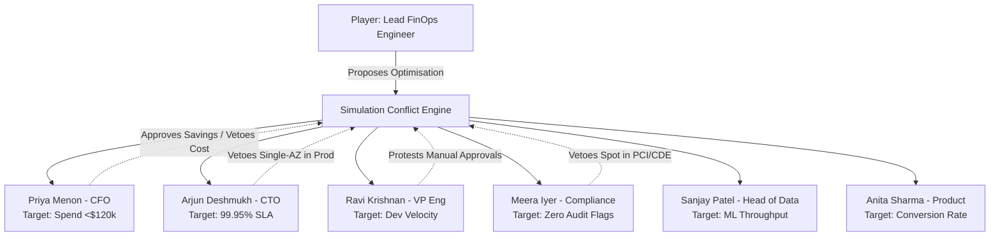
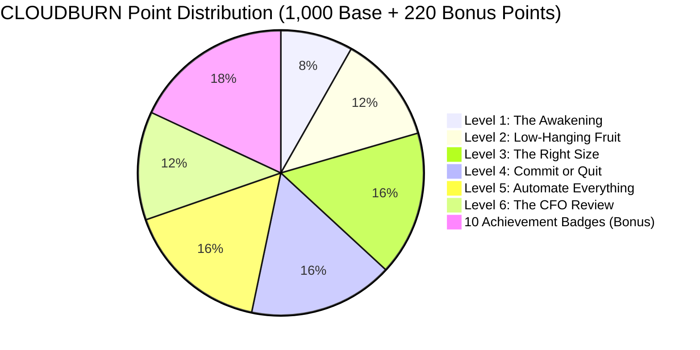

# CLOUDBURN: The FinOps War Room Simulator — Strategic Business & Pedagogical Specification

**Document Reference:** FINOPS-SIM-001  
**Platform Concept:** CloudBurn — The FinOps War Room Simulator  
**Organization:** Zetheta Algorithms Private Limited (Educational & Assessment Platform)  
**Target Audience:** DevOps Engineers, Cloud Architects, FinOps Practitioners, MBA & Engineering Candidates  
**Pedagogical Objective:** Experiential mastery of cloud financial management, multi-stakeholder negotiation, regulatory-constrained infrastructure optimization, and CFO-ready financial modeling.  

---

## 1. Executive Concept & Business Narrative

### 1.1 The Backstory: LendFlow Technologies in Crisis
**LendFlow Technologies** is a fast-growing, cloud-native digital lending platform headquartered in Mumbai, India. Launched 18 months ago, the platform revolutionized consumer credit by deploying machine learning underwriting models that disburse personal and MSME loans in under 180 seconds. In its first year of operation, LendFlow grew exponentially from **10,000 to over 200,000 monthly active borrowers**, processing over **500,000 monthly loan applications** across 12 microservices deployed on AWS (`ap-south-1`).

However, during this hyper-growth phase, the engineering team pursued feature delivery velocity and uptime at all costs. Infrastructure efficiency was ignored:
- Cloud infrastructure expenditure escalated from **$50,000/month to $180,000/month** (+260%) in 12 months, while gross revenue only doubled from **$500,000 to $1,000,000/month** (+100%).
- Gross margins deteriorated from a healthy **75.0% down to 55.0%**, severely impacting unit economics.
- The unit infrastructure cost per loan application surged from **$0.238 to $0.346 (+45.4%)**, proving that infrastructure was scaling super-linearly with massive technical debt.

### 1.2 The Crisis & Ultimatum
LendFlow is preparing for its crucial **Series B venture capital financing round** ($30M target). During preliminary financial due diligence, institutional investors flagged the collapsing gross margin and runaway AWS burn rate as unacceptable operational inefficiency.

**Priya Menon (CFO)** issued an executive ultimatum to **Arjun Deshmukh (CTO)**:
> *"Reduce our AWS cloud expenditure by at least 33.3%—saving a minimum of $60,000 per month—within 90 days, bringing monthly cloud spend to $120,000 or below. Crucially, you must not degrade our 99.95% availability SLA, impair engineering velocity, or breach any PCI DSS, SOC 2, or RBI regulatory requirements. Failure to hit this target will force us to delay our Series B round, threatening our runway."*

You are hired as the **Lead FinOps Engineer** embedded in the cross-functional War Room. You must analyze 6 months of simulated telemetry, eliminate waste, design policy guardrails, negotiate with resistant stakeholders, and present a bulletproof, CFO-ready 90-day plan.

---

## 2. Dynamic Stakeholder Personas & Conflict Engine

The simulation engine models organizational complexity through an interactive conflict system where decisions trigger stakeholder feedback, credibility shifts, and potential vetoes:

### 2.1 Persona Decision Logic:
1. **Priya Menon (CFO):**
   - *Behavior:* Rewards high dollar savings, low payback periods (<3 months), and predictable forecast models.
   - *Trigger Point:* Rejects multi-year all-upfront commitments ($95k cash drain) during pre-Series B cash conservation.
2. **Arjun Deshmukh (CTO):**
   - *Behavior:* Guards system resilience. Enforces Multi-AZ databases and conservative auto-scaling scale-in timers.
   - *Trigger Point:* Automatically vetoes downsizing instances if P99 latency spikes above 250ms or if single points of failure are introduced in production.
3. **Ravi Krishnan (VP Engineering):**
   - *Behavior:* Defends developer velocity. Rejects manual sign-off bureaucracy.
   - *Trigger Point:* If non-production auto-shutdown has no Slack self-service override, team morale drops and developer friction causes a 15% velocity penalty.
4. **Meera Iyer (Head of Compliance):**
   - *Behavior:* Zero tolerance for regulatory risks.
   - *Trigger Point:* Immediate catastrophic failure (Game Over) if Spot instances are assigned to Payment Gateway (`PCI DSS v4.0` violation) or if audit logs in S3 lack WORM compliance (`SOC 2 Type II` / `RBI IT` breach).
5. **Sanjay Patel (Head of Data Engineering):**
   - *Behavior:* Defends machine learning pipelines and batch processing windows.
   - *Trigger Point:* Accepts Spot Fleets for KYC OCR only if diversified across $\ge 4$ instance types with checkpointing.
6. **Anita Sharma (Product Manager):**
   - *Behavior:* Advocates for borrower user experience.
   - *Trigger Point:* Flags P99 latency spikes during salary-day disbursement surges (1st & 15th of the month). Requires predictive pre-warming.

---

## 3. Simulation Modes

CLOUDBURN provides three distinct gameplay modes designed for progressive learning, team competition, and customized institutional training:

### 3.1 Campaign Mode: The 90-Day FinOps Sprint (Core Progression)
Campaign Mode is structured across **6 sequential levels** spanning the Inform, Optimise, and Operate lifecycle:

| Level | Title | Duration / Scope | Core Challenge & Pedagogical Objective | Success Criteria | Total Points |
| :---: | :--- | :---: | :--- | :--- | :---: |
| **Level 1** | **The Awakening** | Day 0–15 | Forensic discovery across 8 simulated billing datasets. Calculate MoM growth, unit economics ($/app), and uncover dark spend ($75k+ untagged). | Correctly identify at least 8 of the embedded waste patterns with accurate dollar quantification ($\pm 15\%$). | **100** |
| **Level 2** | **Low-Hanging Fruit** | Day 16–30 | Immediate quick-win execution: delete orphan EBS volumes, purge expired snapshots, and terminate abandoned sandboxes. | Realize $\ge \$15,000/\text{month}$ in verified net savings with zero production customer impact. | **150** |
| **Level 3** | **The Right Size** | Day 31–45 | Analyze 30-day continuous CPU/RAM telemetry for 40 compute and 12 database instances. Downsize over-provisioned resources while protecting peak headroom. | Complete rightsizing plan covering all over-provisioned nodes with formal performance validation methodology. | **200** |
| **Level 4** | **Commit or Quit** | Day 46–60 | Model 1-Year vs. 3-Year Savings Plans and Reserved Instances. Balance cash upfront, discount percentage, and architectural lock-in risk. | Savings Plan / RI strategy achieves $\ge 25\%$ savings on steady-state baseline with risk-adjusted ROI model. | **200** |
| **Level 5** | **Automate Everything** | Day 61–75 | Architect asymmetric auto-scaling for 6 microservices, calendar-aware predictive scaling, automated dev/staging scheduling, and anomaly alerting. | Complete auto-scaling specs with cooldowns, metrics, Spot mix ratios, and simulated anomaly alert SLAs $<2$ hours. | **200** |
| **Level 6** | **The CFO Review** | Day 76–90 | Present the comprehensive FinOps Framework to the executive board panel. Defend assumptions, confidence intervals, and governance against stakeholder scrutiny. | Board panel approval score $>90\%$; total projected savings $\ge \$60,000/\text{month}$ with defensible roadmap. | **150** |
| **TOTAL** | — | **90 Days** | **Comprehensive FinOps Transformation** | **Net Monthly Savings: $64,250.00 (35.7% Reduction)** | **1,000** |

---

### 3.2 Arena Mode: Competitive Cost Optimization Hackathon
Designed for classroom, university, and enterprise hackathons (e.g., 48-hour competitive sprint):
- **Identical Starting Baseline:** Every team receives the raw 8 datasets representing the $180,000/month spend.
- **Automated Grading Engine:** Submissions are parsed by an automated evaluation pipeline checking:
  1. *Total Verified Monthly Savings:* 300 Points (Scaled from $60,000 threshold).
  2. *Compliance Score:* 200 Points (Deductions: -50 pts per PCI/SOC2 violation).
  3. *Policy-as-Code Syntactic & Logical Rigor:* 200 Points (Terraform, SCP, AWS Config validity).
  4. *Governance & Stakeholder Architecture:* 150 Points (RACI, review cadences, escalation).
  5. *Presentation & CFO Defensibility:* 150 Points (Clarity, confidence intervals, payback).
- **Live Leaderboard:** Real-time dashboard showing team rankings, projected run-rates, and badge achievements.

---

### 3.3 Sandbox Mode: Custom Scenario Builder
Enables instructors, mentors, and students to generate customized simulation environments by tweaking parameters:
- **Cloud Provider Architecture:** AWS-Only, GCP-Only (BigQuery, CUDs, GKE), or Multi-Cloud Hybrid.
- **Industry Vertical:**
  - *Fintech Lending:* (High compliance, predictable salary cycles, PCI DSS, RBI IT).
  - *B2B SaaS:* (Multi-tenant isolation, elastic web APIs, high AWS NAT gateway traffic).
  - *E-Commerce:* (Extreme flash-sale seasonality, Black Friday burst scaling).
  - *HealthTech:* (HIPAA data isolation, extreme audit log retention, strict compute isolation).
- **Company Stage:** Early Seed ($10k/mo spend), Growth Series A/B ($180k/mo spend), or Pre-IPO Enterprise ($2M+/mo spend).
- **Custom Budget Constraints:** Configurable target reduction (20% to 50%).

---

## 4. Scoring & Achievement System (10 Badges)

CLOUDBURN gamifies student engagement through a structured badge achievement framework. Each badge targets a core FinOps professional competency and awards bonus points toward the final grade:

| Badge Icon | Badge Title | Pedagogical Criteria & Challenge | Bonus Points | Core Skill Validated |
| :---: | :--- | :--- | :---: | :--- |
| 🕵️‍♂️ | **Waste Hunter** | Discover and quantify $\ge 10$ unique embedded waste categories across the 8 datasets with dollar accuracy $\pm 10\%$. | **+25** | Exploratory Data Analysis & CUR Auditing |
| 🏷️ | **Tag Commander** | Design a comprehensive tagging taxonomy with 10 mandatory tags and 100% policy-as-code SCP & Config enforcement. | **+20** | Cloud Governance & Preventative Guardrails |
| 💼 | **Reservation Strategist** | Engineer a 1-Year Savings Plan / RI portfolio achieving $>35\%$ blended savings with payback $<45$ days and zero over-commitment. | **+30** | Financial Engineering & Commitment Risk Modeling |
| ⚡ | **Spot Master** | Design fault-tolerant Spot fleet architecture across $\ge 3$ asynchronous workload types with sub-minute checkpointing and zero SLA breach. | **+25** | Elastic Architecture & Resilient Distributed Systems |
| 🔍 | **Anomaly Detective** | Build a multi-layered anomaly detection model achieving MTTD $<2$ hours with $<5\%$ false positive rate during salary surges. | **+20** | Statistical Modeling & Alerting Architecture |
| 🛡️ | **Compliance Guardian** | Execute all cost reductions with 100% compliance across PCI DSS v4.0, SOC 2 Type II, and RBI IT Framework (zero audit penalties). | **+30** | Regulatory Architecture & Risk Governance |
| 🏛️ | **Governance Architect** | Design a complete FinOps operating model: RACI matrix, 4 review cadences, 4-tier budget hierarchy, and escalation paths. | **+20** | Organizational Design & Executive Leadership |
| 📊 | **Dashboard Designer** | Deliver publication-quality interactive cost dashboards across Executive, Engineering Manager, and Squad tiers. | **+15** | Data Visualization & Stakeholder Communication |
| 📈 | **Unit Economics Pioneer** | Calculate and trend cost-per-transaction ($/loan application, $/KYC check) connecting cloud spend directly to business outcomes. | **+20** | Cloud Financial Economics & Unit Modeling |
| 🎯 | **CFO Whisperer** | Score $\ge 90\%$ on the final CFO Review Board Presentation, successfully defending ROI, payback, and risk mitigation against cross-examination. | **+25** | Executive Presence & Financial Communication |

---

## 5. Simulation Architecture & Technical Design

The CLOUDBURN platform operates via an interactive web interface powered by client-side state management:
1. **Financial State Engine:** Tracks baseline spend ($180,000), implemented recommendations, resulting monthly savings, target run-rate ($115,750), and unit cost per application ($0.346 $\rightarrow$ $0.223$).
2. **Interactive Decision Toggles:** Players can test various actions (e.g. "Migrate to GP3", "Buy 3-Year All Upfront SP", "Apply Dev Scheduling") and immediately observe the multi-dimensional impact on cash flow, availability risk, and stakeholder sentiment.
3. **Dialogue Engine:** Interactive conversation trees simulating Priya Menon, Arjun Deshmukh, and Meera Iyer challenging the player's proposals with real-time feedback.
4. **Automated Validation:** Generates an end-of-game FinOps scorecard evaluating cost reduction, compliance integrity, and operational feasibility.

---

## 6. Intellectual Property & Pedagogical Governance

In accordance with institutional assessment standards administered by **Zetheta Algorithms Private Limited**:
- **Platform IP (Proprietary to Zetheta):** The CLOUDBURN simulation concept, including narrative world-building, fictional personas, scoring algorithms, level progression mechanics, and simulated billing datasets, constitutes proprietary intellectual property.
- **Output IP (Owned by Student/Candidate):** All original analytical models, policy-as-code implementations, architectural specifications, and presentation artifacts developed by candidates remain the intellectual work of the participant.
- **Pedagogical Parity:** This distinction mirrors industry standard employment agreements and prepares students for commercial engineering roles where corporate IP boundaries must be respected.
