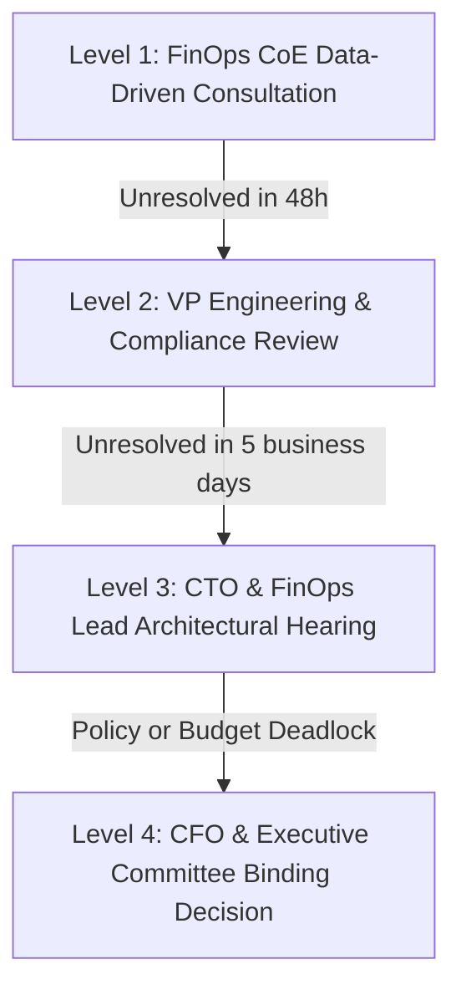

# LendFlow Technologies — Stakeholder Priority Matrix & Conflict Governance

**Document Reference:** FINOPS-DOC-002  
**Classification:** Executive Governance & Stakeholder Alignment Standard  
**Lead Authors:** Lead FinOps Engineer & Principal Cloud Architect (FinOps CoE)  
**Presented To:** Priya Menon (CFO), Arjun Deshmukh (CTO), Ravi Krishnan (VP Engineering), Meera Iyer (Head of Compliance), Sanjay Patel (Head of Data), Anita Sharma (Product Manager)  
**Effective Date:** September 2026 (Month 12 Baseline)  

---

## 1. Executive Overview & Problem Context

LendFlow Technologies’ AWS infrastructure expenditure escalated from **$50,000 to $180,000 per month** over the past 12 months, significantly outpacing top-line revenue growth (+260% cost vs. +100% revenue). The root cause of this unchecked growth lies in organizational silos, unaligned incentives, and conflicting team priorities:

- **Engineering** prioritized delivery velocity and architectural redundancy over financial efficiency.
- **Product** demanded instant time-to-market and seamless zero-latency user experiences without considering resource sizing.
- **Data Engineering** provisioned high-memory GPU and multi-terabyte analytics instances 24/7 for burst workloads.
- **Compliance** enforced strict risk aversion, rejecting shared infrastructure and aggressive data pruning.
- **Finance** tracked spend retrospectively via monthly invoices without granular unit cost visibility or real-time guardrails.

To achieve the executive mandate of reducing cloud spend by **33%+ (at least $60,000/month in net savings)** within 90 days—reaching **$115,750/month ($64,250/month savings)**—a multi-stakeholder governance alignment framework is required.

---

## 2. Comprehensive Stakeholder Priority & Trade-Off Matrix

The matrix below maps each executive persona’s primary goals, underlying concerns, risk sensitivity, and the structured FinOps alignment strategy:

| Stakeholder Persona | Organizational Role | Core Priority | Primary Risk Concern | Potential Inter-Team Conflict | FinOps Alignment Strategy & Compromise | RACI Role |
| :--- | :--- | :--- | :--- | :--- | :--- | :---: |
| **Priya Menon** | Chief Financial Officer (CFO) | Reduce AWS spend by 33%+ ($60,000/month) within 90 days; achieve predictable budget variance (<5%). | Long-term capital lock-in; financial forecasting inaccuracy; delayed Series B funding. | May push for overly aggressive compute cuts or multi-year all-upfront commitments that impair technical agility. | Provide transparent monthly forecasts, 1-Year Partial Upfront Savings Plans (1.23-month payback), unit cost tracking ($/loan app), and weekly showback dashboards. | **Accountable (A)** for Budgets & Commitments |
| **Arjun Deshmukh** | Chief Technology Officer (CTO) | Maintain platform availability (99.95% SLA), system scalability, and technical excellence. | Availability degradation, operational fragility, infrastructure instability during peak load. | Highly resistant to changes that introduce deployment friction, single points of failure, or operational fragility. | Guarantee Multi-AZ topology for core databases, enforce conservative scale-in thresholds (15-min cooldown), and preserve dedicated capacity for mission-critical paths. | **Consulted / Accountable** for Architecture & SLA |
| **Ravi Krishnan** | VP of Engineering | Protect engineering velocity, deployment cadence, and developer autonomy. | Developer bottlenecks; slow PR approvals; disruptions from scheduled environment shutdowns. | Opposes mandatory tagging gates, instance size restrictions in dev, and automated shutdowns that interrupt off-hours testing. | Implement automated 9 AM–7 PM dev scheduling with a one-click Slack/CLI override (`/finops resume-dev`); embed Infracost cost checks seamlessly into GitHub Actions PRs. | **Responsible (R)** for Execution; **Accountable (A)** for Squad Spend |
| **Meera Iyer** | Head of Compliance | Zero audit findings across PCI DSS v4.0, SOC 2 Type II, RBI IT Framework, and GDPR. | Regulatory penalties, compliance breaches, cross-tenant data leaks, loss of audit trails. | Blocks compute consolidation in payment tiers, data lifecycle archiving, and cross-border resource sharing. | Explicitly exclude PCI DSS payment gateways from Spot instances; maintain SOC 2 audit logs in immutable S3 Glacier WORM (Object Lock); preserve RBI Multi-AZ database replication in Mumbai (`ap-south-1`). | **Accountable (A)** for Regulatory Guardrails |
| **Sanjay Patel** | Head of Data Engineering | High-throughput ML training, real-time feature store queries, and scalable data lakes. | Pipeline timeouts, memory starvation, batch job failures from spot interruptions. | Requests unconstrained GPU clusters and 24/7 dedicated `r5.4xlarge` worker fleets. | Implement diversified Spot Fleets with 20% on-demand base for batch OCR/ETL, sub-minute checkpointing to S3, and migrate ad-hoc analytics to Athena/S3 serverless lake. | **Responsible (R)** for Data Pipelines & Spot Fleet |
| **Anita Sharma** | Product Manager | Rapid launch of new credit products, frictionless customer checkout, zero transaction latency. | Application checkout friction, drop-offs during marketing campaigns, P99 latency spikes. | Demands pre-warmed production clusters and resists auto-scaling scale-in policies. | Deploy predictive auto-scaling that pre-warms capacity 30 minutes before salary-day traffic spikes (1st & 15th of month); track cost-per-loan-application to prove efficiency gains. | **Consulted (C)** for Growth & Feature Rollouts |

---

## 3. Detailed Persona Profiles & Behavioral Analysis

### 3.1 Priya Menon — Chief Financial Officer (CFO)
- **Background:** Ex-investment banker, 15+ years experience in corporate finance, preparing LendFlow for Series B venture round.
- **Key Metric:** Gross Margin (eroded from 75% to 55%), Monthly Cloud Run-Rate, Operating Cash Flow.
- **Communication Style:** Data-driven, bottom-line focused, demands financial defensibility and confidence intervals.
- **Negotiation Stance:** "I don't care how you engineer it—cloud spend must be under $120k next quarter or we freeze engineering hiring."
- **FinOps Response:** "By implementing $64,250/month in net savings, we reduce spend to $115,750/month (35.7% cut), improve gross margins to 68.4%, achieve a 1.23-month payback on commitments, and provide automated weekly burn-rate reports."

### 3.2 Arjun Deshmukh — Chief Technology Officer (CTO)
- **Background:** Ex-FAANG Principal Systems Architect, built LendFlow's microservice mesh from scratch.
- **Key Metric:** 99.95% Availability SLA, P99 Latency (<200ms), Mean Time to Recovery (MTTR).
- **Communication Style:** Highly technical, systems-oriented, skeptical of financial interference in architectural decisions.
- **Negotiation Stance:** "If a cost cut causes a payment timeout or drops our availability below 99.95%, the cost savings will be wiped out in regulatory fines and customer churn."
- **FinOps Response:** "All rightsizing is backed by 30-day continuous p95 telemetry showing <20% CPU. Primary databases retain synchronous Multi-AZ failover. Asymmetric auto-scaling scales out in 60s and scales in slowly over 15 minutes."

### 3.3 Ravi Krishnan — VP of Engineering
- **Background:** Agile engineering leader managing 60+ engineers across 6 squads.
- **Key Metric:** Sprint Velocity, Deployment Frequency, Developer Satisfaction, Time-to-Merge.
- **Communication Style:** Pragmatic, delivery-focused, protects his teams from administrative overhead.
- **Negotiation Stance:** "Do not force my engineers to spend 20% of their sprint filling out FinOps spreadsheets or troubleshooting why their dev environment shut down."
- **FinOps Response:** "All governance is policy-as-code. Infracost comments directly on Pull Requests. Non-prod shutdown is 100% automated with a simple Slack `/finops keep-alive` command if developers work late."

### 3.4 Meera Iyer — Head of Compliance & Legal
- **Background:** Regulatory compliance specialist in Indian NBFC/Fintech sector, ex-RBI compliance consultant.
- **Key Metric:** Zero Non-Conformances in PCI DSS v4.0 QSA audit, SOC 2 Type II attestation, RBI IT Guidelines compliance.
- **Communication Style:** Methodical, risk-averse, requires legal and audit citations for every architectural modification.
- **Negotiation Stance:** "Cost savings are irrelevant if an auditor flags shared infrastructure in our Cardholder Data Environment or unencrypted cross-border data transfer."
- **FinOps Response:** "We created a formal Compliance Impact Assessment for all 16 recommendations. PCI DSS Cardholder Data Environment is 100% isolated and excluded from Spot. SOC 2 audit logs use S3 Glacier WORM Object Lock. All data stays in AWS Mumbai (`ap-south-1`)."

### 3.5 Sanjay Patel — Head of Data Engineering
- **Background:** Machine learning engineer, builds loan credit risk scoring and fraud models.
- **Key Metric:** Model Training Time, Data Ingestion Throughput, Feature Store Query Latency.
- **Communication Style:** Experimental, compute-hungry, values throughput over cost efficiency.
- **Negotiation Stance:** "Our underwriting models require massive datasets. Downsizing worker instances will delay credit decisions by hours."
- **FinOps Response:** "We retain high-memory `r5.2xlarge` instances for real-time scoring, while converting batch KYC OCR and offline risk simulations to diversified Spot Fleets with checkpointing, cutting costs by 70% with zero throughput penalty."

### 3.6 Anita Sharma — Product Manager
- **Background:** Fintech product strategist driving user acquisition and borrower retention.
- **Key Metric:** Loan Conversion Rate, Daily Active Users (DAU), Funnel Completion Speed.
- **Communication Style:** User-centric, growth-oriented, responsive to customer feedback.
- **Negotiation Stance:** "If borrowers experience latency or HTTP 504 errors on salary day, they abandon the app and apply with our competitors."
- **FinOps Response:** "Our predictive scaling pre-warms compute fleets at 5:30 AM IST on the 1st and 15th of every month, ensuring instant capacity before the 6:00 AM user surge hits."

---

## 4. Conflict Resolution Framework & Escalation Ladder

When stakeholder priorities clash during implementation, the following 4-step governance ladder resolves disputes:

1. **Level 1 — Data-Driven Consultation (FinOps CoE):**
   - FinOps Engineer reviews 30-day telemetry, metrics, and Infracost data with the Squad Lead.
   - 80% of disagreements (e.g. rightsizing a staging instance) are resolved here through objective telemetry.
2. **Level 2 — Technical & Compliance Review:**
   - Evaluates operational feasibility with Ravi Krishnan (VP Eng) and regulatory guardrails with Meera Iyer.
   - If a proposed cut violates compliance or developer velocity, alternative architectural solutions are designed.
3. **Level 3 — Architectural Hearing (CTO Level):**
   - Formal review between Arjun Deshmukh and FinOps Lead regarding core production changes (e.g., database replica decommissioning, Savings Plan commitment levels).
4. **Level 4 — Executive Committee Binding Determination (CFO Level):**
   - Priya Menon and Executive Committee review unresolved budget or risk trade-offs. The decision is final and logged in `CHANGELOG.md`.

---

## 5. Stakeholder Communication Cadence

To maintain proactive alignment and prevent surprises, the FinOps CoE maintains four structured touchpoints:

| Meeting Cadence | Frequency | Primary Participants | Focus / Deliverable |
| :--- | :--- | :--- | :--- |
| **Daily Cost Telemetry Check** | Daily (15 min automated) | FinOps Lead, On-Call SRE | Investigate overnight cost anomalies, P1/P2 alerts, and budget burn rate. |
| **Weekly Tactical FinOps Review** | Weekly (45 min) | FinOps Lead, Ravi Krishnan, Squad Tech Leads | Review rightsizing backlog, tag compliance scores, and dev scheduling adherence. |
| **Monthly Operational FinOps Review** | Monthly (60 min) | FinOps Lead, Priya Menon, Arjun Deshmukh, Meera Iyer | Present month-end actuals vs. budget, realized savings, unit economics ($/app). |
| **Quarterly Strategic FinOps Review** | Quarterly (90 min) | CFO, CTO, VP Eng, Compliance Head, Product Head | Evaluate 1-Year/3-Year Savings Plans renewals, Graviton migration ROI, annual cloud budget. |

---

## 6. Success Metrics & Alignment Verification

Stakeholder alignment is tracked quantitatively each month:
- **CFO Satisfaction:** Budget variance $< \pm 5\%$; realized monthly savings $\ge \$60,000.00$.
- **CTO Satisfaction:** 99.95% Availability SLA maintained; zero infrastructure-induced outages.
- **Engineering Satisfaction:** $<5$ hours/month per squad spent on FinOps administrative tasks; zero blocked PRs without clear remediation paths.
- **Compliance Satisfaction:** Zero audit non-conformances across PCI DSS, SOC 2, and RBI IT frameworks.
- **Product Satisfaction:** P99 transaction latency $< 200\text{ms}$; zero customer drop-offs from capacity bottlenecks.
