# LendFlow Technologies — Enterprise Tagging Taxonomy & Cost Allocation Governance

**Document Reference:** FINOPS-DOC-005  
**Classification:** Enterprise Policy & Technical Architecture  
**Primary Authors:** Senior FinOps Engineer, Cloud Architect, Governance Lead  
**Approvals:** Priya Menon (CFO), Ravi Krishnan (VP Eng), Meera Iyer (Head of Compliance)  
**Effective Date:** September 2026  

---

## 1. Executive Summary & Audit Baseline

Prior to this FinOps initiative, LendFlow Technologies suffered from pervasive tagging entropy. Our baseline audit in `data/tag_compliance_report.csv` across 150+ active AWS cloud assets revealed:
* **Overall Resource Tag Compliance:** **58.2%**
* **Untagged / Unallocable "Dark Spend":** **$75,420.00 / month** (41.9% of total AWS expenditure)
* **Team Attribution Gap:** Finance could not identify the team or business unit responsible for over 40% of compute and data transfer spend.
* **Orphan Asset Proliferation:** Sandboxes and test clusters created by individual developers lacked `ttl` and `created_by` tags, resulting in abandoned $500+/month instances running undetected for quarters.

```text
Tagging Compliance by Environment:
- Production: 78.4% Compliant (Partially tagged via legacy Terraform)
- Staging:    44.1% Compliant (Manual changes, incomplete tags)
- Dev / Test: 26.5% Compliant (High velocity ad-hoc experimentation)
```

To eliminate dark spend and achieve **100% cost allocation predictability**, this document defines the mandatory 10-tag schema, strict validation rules, and a **4-Layer Automated Governance Engine**.

---

## 2. Mandatory 10-Tag Taxonomy Specification

Every AWS resource provisioned across LendFlow's AWS Organization must carry the following 10 standardized tags (lower-case key names, hyphen-delimited values):

| # | Tag Key | Mandatory / Optional | Allowed Values / Format | Description & Purpose | Cost Allocation Impact |
| :- | :--- | :--- | :--- | :--- | :--- |
| 1 | `business_unit` | **Mandatory (All)** | `retail-lending`, `msme-credit`, `risk-analytics`, `payments-core`, `platform-engineering` | High-level organizational division responsible for P&L. | Top-tier CFO chargeback |
| 2 | `product` | **Mandatory (All)** | `personal-loan`, `merchant-credit`, `credit-line`, `scoring-api`, `shared-platform` | Customer-facing fintech product generating revenue. | Unit economic margin tracking |
| 3 | `environment` | **Mandatory (All)** | `prod`, `staging`, `dev`, `sandbox`, `dr` | Deployment stage and lifecycle boundary. | Non-prod scheduling & compliance |
| 4 | `cost_centre` | **Mandatory (All)** | `CC-101` (Retail), `CC-102` (Risk), `CC-103` (Payments), `CC-104` (Platform), `CC-105` (Data) | General Ledger (GL) financial code for accounting journal entries. | NetSuite ERP reconciliation |
| 5 | `team` | **Mandatory (All)** | `lending-core`, `risk-scoring`, `payments`, `data-eng`, `platform`, `secops` | Engineering squad owning daily maintenance and SLA. | Engineering manager showback |
| 6 | `service` | **Mandatory (All)** | `loan-app-api`, `underwriting-engine`, `kyc-ocr`, `payment-gateway`, `disbursement`, `auth`, `analytics-etl` | Microservice catalog name registered in Backstage. | Microservice unit cost |
| 7 | `created_by` | **Mandatory (All)** | Email or IAM/SSO identity (e.g. `arjun.d@lendflow.tech`, `terraform-pipeline`) | Individual engineer or CI/CD automated principal. | Accountability & rogue spend |
| 8 | `ttl` | **Mandatory (Dev/Stage)** | ISO date `YYYY-MM-DD` or `permanent` (Prod only) | Time-to-Live expiration date for automated reaping. | Dev sandbox hygiene |
| 9 | `compliance_scope`| **Mandatory (All)** | `pci-dss-cde`, `soc2-audit`, `rbi-core`, `gdpr-eu`, `non-regulated` | Regulatory boundary for audit segmentation. | Audit readiness & isolation |
| 10| `data_classification`| **Mandatory (All)**| `restricted-pii`, `confidential-financial`, `internal`, `public` | Data sensitivity governing backup, encryption, and tiering. | S3 lifecycle & security |

---

## 3. Four-Layer Tag Governance Engine

To ensure tagging compliance never regresses, we implement defense-in-depth across four automated operational tiers:

```mermaid
graph TD
    subgraph Layer1["1. PREVENTIVE (Block non-compliant creation)"]
        P1[Terraform Pre-Commit TFLint] --> P2[Infracost PR Check]
        P2 --> P3[AWS Organizations SCP Policy]
    end
    
    subgraph Layer2["2. DETECTIVE (Continuous Real-Time Auditing)"]
        D1[AWS Config Rule: required-tags] --> D2[EventBridge Evaluation]
        D2 --> D3[Compliance Dashboard Stream]
    end
    
    subgraph Layer3["3. CORRECTIVE (Automated Remediation & Reaping)"]
        C1[EventBridge Rule: Non-Compliant Event] --> C2[Remediation Lambda]
        C2 --> C3{Environment?}
        C3 -->|Dev / Sandbox| C4[Quarantine & 48h Stop / Termination]
        C3 -->|Prod / Staging| C5[Slack Alert to Squad Lead + JIRA Ticket]
    end
    
    subgraph Layer4["4. AUDIT & SHOWBACK (Executive Visibility)"]
        A1[AWS Cost Allocation Tags Activated] --> A2[AWS Cost & Usage Report CUR]
        A2 --> A3[Weekly Team Showback & CFO Dashboard]
    end

    Layer1 -.->|Catches 90%| Cloud
    Layer2 -.->|Monitors 100%| Cloud
    Layer3 -.->|Enforces| Cloud
    Layer4 -.->|Allocates $180k Spend| Finance
```



### Layer 1: Preventive Controls
1. **Service Control Policy (SCP):** Implemented at the AWS Organizations root. Denies API calls for `ec2:RunInstances`, `rds:CreateDBInstance`, and `s3:CreateBucket` if any of the mandatory tags are missing.
2. **Terraform Cost Module:** All infrastructure must be instantiated through our standardized module with input validation rules enforcing allowed regex patterns.

### Layer 2: Detective Controls
1. **AWS Config Rules (`required-tags`):** Continuously scans all provisioned AWS resources every 60 minutes.
2. Flags untagged or malformed resources as `NON_COMPLIANT` and publishes telemetry to CloudWatch Metrics.

### Layer 3: Corrective Controls (Remediation Lambda)
1. **Non-Production Quarantine:** Any resource in `dev` or `sandbox` missing `team`, `created_by`, or `ttl` triggers an EventBridge event to `lambda-finops-tag-remediation`. The owner receives a Slack notification giving 24 hours to remediate. If unresolved at 48 hours, the instance is automatically stopped.
2. **Production Safety Gate:** Corrective automation **never terminates production resources**. For production violations, a High-Severity P2 JIRA ticket is dispatched to the squad lead with a 5-day remediation SLA.

### Layer 4: Audit & Showback
1. **Cost Allocation Tag Activation:** All 10 mandatory tags are registered as active User-Defined Cost Allocation Tags in AWS Billing.
2. **Weekly Showback Reports:** Every Monday at 9:00 AM IST, squad leads receive a breakdown of their cloud spend by microservice and product, eliminating untagged dark spend.

---

## 4. Shared Cost Allocation Model

Shared infrastructure that cannot be tagged to a single squad (e.g. centralized NAT Gateways, VPC Transit Gateways, shared Kubernetes system daemons) represents **$14,500/month**. 

LendFlow applies a **Proportional Consumption Allocation Methodology**:
$$\text{Allocated Shared Cost}_{\text{Team}} = \text{Total Shared Cost} \times \left( \frac{\text{Direct Tagged Spend}_{\text{Team}}}{\sum \text{Direct Tagged Spend}_{\text{All Teams}}} \right)$$

This ensures 100% of the AWS bill is distributed across business units without artificial "FinOps overhead pools".
